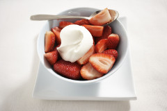
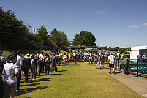
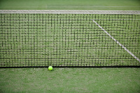
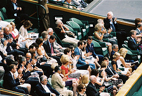

## THE CHAMPIONSHIP AND THE COURTS
Dating back to 1877, Wimbledon is the oldest international tennis event in the world. Of course, it is also one of the four _Grand Slams_ - the most important tennis championships in the world. The other three are the US Open (which dates back to 1881), the French open (1891) and the Australian Open, first held in 1905\. Of the four Grand Slams, however, only Wimbledon had any international significance prior to 1924\. Wimbledon is also the only one of the Grand Slams which is still played on a natural surface – grass. The US and Australian championships moved to artificial (hard) courts in 1975 and 1988 respectively, whilst the French have always played on clay.
### 1\. THE COURTS AND THE HAWK

The grass courts at Wimbledon are maintained to very high standards. They are 100% pure rye grass, which is cut to exactly one third of an inch (or eight millimetres) in height. Because the courts are natural, they are also more unpredictable than artificial surfaces. The game on grass is very fast, and balls can bounce in unexpected ways because of the underlying ground. However, the grass courts bring special problems- not the least of which are pigeons and other wild birds. They are kept away from the courts by a very important member of the Wimbledon team- a hawk. The current hawk is called Rufus, who became famous in his own right when he was stolen from a parked van in 2012\. He was found three days later in a nearby park. Rufus flies round the courts three mornings a week during tournaments, and once a week during the rest of the year.

### 2\. STRAWBERRIES AND CREAM

For many people, Wimbledon is synonymous with strawberries and cream. It is said that Cardinal Wolsey, secretary to King Henry VIII, was the first to add cream to his strawberries, way back in the 1500s; and they have been consumed together at the tournament since 1884\. During the tournament fortnight, spectators typically consume 28 tons of strawberries and 7,000 litres of thick double cream.

### 3\. UMBRELLAS

It almost always rains during Wimbledon, and fans know to come with optimism and a big umbrella. Since 1922, every tournament except for 7 has been interrupted at least once by England's wet summer weather. However, on Centre Court the rain is no longer a problem. A special roof, which opens and closes in just 10 minutes, was installed in 2009\. The show must go on!

### 4\. THE QUEUE

Everyone knows that the British love to queue. It conforms to a national sense of fairness - and is undeniably more civilised than the uncertainty and unfairness of unordered chaos. Thousands of fans camp overnight in the queue, in the hope of getting tickets for the next day's tournament. There is a Wimbledon Code of Conduct for queuing, which says that those queuing must be present in person, and may not place things in the queue to hold their place. Unpaid volunteer Stewards keep the queue in order, and enforce the code of conduct.

### 5\. BALL BOYS AND GIRLS

Each year there about 250 ball boys and girls at the tournament. Their average age is 15, and they must recover the balls which go out of play. They are chosen from local schools, and must work very hard for the privilege. They train from February to June, for two hours a session, four times a week. They must be experts on tennis, and must also learn how to stand and move correctly on the delicate grass court.

### 6\. ROYALTY

The first members of the British Royal Family to attend were George, Prince of Wales and his wife Mary, in 1907, three years before he became King George V. Rain interrupted their visit. In the last century, Royals were ardent supporters of Wimbledon Championships. The famous Princess Diana, before her sudden demise, was often seen as a spectator at Wimbledon matches. The Queen is presently the sponsor of the All England Club and the Duke of Kent is its presiding president.

### 7\. ALL WHITE

Players must wear only white at Wimbledon. This tradition dates back to the 1880s, but until 1963 it was merely a tradition. In that year, it became a rule. Umpires, linesmen and ball boys and girls wear official outfits in navy blue and cream, designed by Ralph Lauren in 2006.
