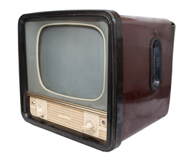

_13.05.2017_

My father, who grew up during the emergence of radio, was (like many at the time) utterly fascinated by the new technology, which opened horizons for many Americans. Radio could send free music, entertainment, and informative programming directly into the living room – and this was as revolutionary in its time as the Internet seems to us today.

He was so fascinated with this new thing that he spent much of his life with it. For thirty years or more, he was the owner of John's Radio & TV Repairs, which was located at 301-303 on Main St. It was the oldest radio and television repair business, though the building in which the shop used to be is now a jewellery store.

He wasn't a technician, or an electrical engineer. He was a labourer. Before he came to open this shop, he had worked for 18 years at the Sparrow's Point shipyard, building boats.

But he didn't want to stay a labourer for all his life. He dreamed of owning his own business. He knew if he wanted to get on, he would have to study. So in the early 1940s he decided to take a correspondence course. This was how most people studied then, by correspondence in their free time. And the course which he took was on radio repair. This was the course which was to change his life.

When he had finished his studies, and taken the exam, he began repairing radios for fellow shipyard workers and family friends. That was how he gained experience and confidence along the way.

His radio repair sideline soon became so lucrative that he quit the shipyard and in 1946, opened John's Radio Sales and Service. Initially the business was in a shop which he rented at number 304 on Main St. The business quickly grew to a substantial operation, and he enlisted the help of his brothers-in-law Ted and Louis Fratta. That was what people did in those days – when they needed help, they asked family!

At that time, Baltimore had no televisions anywhere, neither for sale nor on display. Radio was still the big thing. Everyone had a radio set with big valves. But no-one in my town had ever seen a television. Television had been shown at the World Fair in New York City in 1939\. But with no television stations yet in operation, there was no reason for ordinary people to own a set - even if there had been some place to buy one.

Then in 1947 my father bought a do-it-yourself television kit, which consisted of a bewildering boxful of vacuum tubes, wires. It was delivered by post in a big box one morning.

There is one thing which I particularly remember. I was a six-year old child and I was watching my father. He was building the set from the many parts and schematic drawings. My grandfather, who was watching him work with me, said, "You mean to tell me that a picture is going to float through the air and come out here on this tube?" My father said, "That's right pop!" to which my grandfather replied, "You're crazy!"

Sadly my grandfather passed away before the television set was completed and never got to see pictures fly through the air.

The set was finally finished in mid-1947, and my father proudly displayed it in the shop. It was the very first television in the city of Baltimore. It seemed the entire neighborhood came to see it. I remember even buses would stop outside the shop, and people would get off to see the incredible new invention, which was how everyone thought of it.

With an antenna on the roof and the set on display in the store window, the television instantly became the sensation of the city. Even though there was hardly anything to watch. Baltimore still had no television stations. The only working channel was in Washington, DC, which broadcast for several hours in the evening. There were telecasts of boxing championship matches, which drew huge crowds to the sidewalk in front of John's Radio Sales and Service. My father would have the fights on TV in the store window and many people, probably around a hundred, would stand out front of the store and onto Highland Avenue to watch the fight on a 7-inch screen.

In those days horizontal and vertical picture alignments were not very stable and the picture quality was weak. My father would be constantly adjusting the knobs, while my uncle would be on the roof adjusting the antenna so the crowds could see a better picture. This drew the attention of the local Baltimore newspapers and they printed stories about my father's shop, which had the 'first television' in Baltimore, and about the crowds who came to see it.
