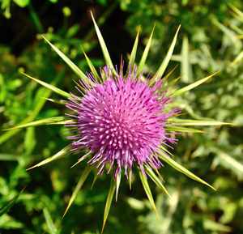

# Benefits of biodiversity

## Why does biodiversity matter?

We are biodiversity. Most of the oxygen we breathe comes from plankton in the oceans of the world and lush forests around the globe. The fruit and vegetables we eat were likely to have been pollinated by bees, and the water we drink is part of a huge global cycle involving us, clouds, rainfall, glaciers, rivers and oceans. Our diet depends almost entirely on the plants and animals around us, from the grasses that give us rice and wheat, to the fish and meat from both wild and farmed landscapes.

Our bodies contain up to 100 trillion cells and are connected with everything around us and the wider world in a wonderfully complex and timeless system. We share our atoms with every being and object in the natural world.

<right></right>

Biodiversity is life, our life is biodiversity and biodiversity is us.

We share the planet with as many as 13 million different living species including plants, animals and bacteria, only 1.75 million of which have been named and recorded. This incredible natural wealth is a priceless treasure that forms the ultimate foundation of our human wellbeing.

The systems and processes these millions of neighbours collectively provide produce our food, water and the air we breathe - the basic fundamentals of life. As if that was not enough they also supply us with timber and plant materials for furniture, building and fuel, the mechanisms that regulate our climate, control floods and recycle our waste and the novel compounds and chemicals from which medicines are made. We may take biodiversity so much for granted, that it is sometimes easy to forget it's there - that we are a part of it and can't live apart from it.

<right></right>

Biodiversity's contribution to our life is not just practical, physical and utilitarian, it is also cultural. The diversity of the natural world has been a constant source of inspiration throughout human history, influencing traditions, the way our society has evolved and supplying the basic goods and services upon which trade and the economy are built. The disappearance of unique species is a loss that cannot be calculated and leaves us all much poorer.

The loss of iconic and symbolic species is not only a cultural tragedy; it also undermines our own survival. The beautiful, bountiful diversity of the natural world is being damaged as a result of human activities. Felling or burning of forests, removal of mangroves, intensive farming, pollution stress, overfishing and the impacts of climate change are all destroying biodiversity.

We can stop this loss, the question is - will we?

Click [here](biodiversity-1) to go back to What is biodiversity?
