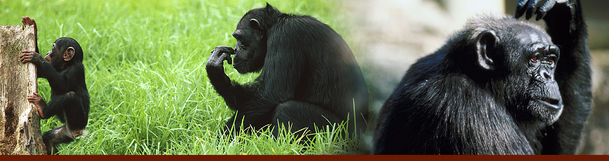

## Bonobos

Bonobos belong to the Great Ape family. Great apes – which also include chimpanzees, orangutans and gorillas – have been observed to display many human-like behaviours and emotions, such as laughter and sadness. Some species even make their own tools to help them survive in their natural habitat. All great ape species have at least 98% of their genetic code in common with that of humans. However, bonobos and chimpanzees share even more of their DNA with humans - up to 98.7% - which makes these two species our closest living relatives.

Bonobos were identified as a distinct species from [chimpanzees](http://en.wikipedia.org/wiki/Chimpanzees) (Pan troglodytes) in 1933\. Bonobos have also been referred to as gracile or pygmy chimpanzees, but these terms are less commonly used today. The name bonobo is probably derived from a mis-spelling of a village in the Congo called Bolobo.

Bonobos are usually slightly smaller, thinner and darker than chimpanzees. Their society is also different - bonobo groups are generally peaceful and are led by females. They tend to maintain relationships and settle conflicts through sex.

Wild bonobos can only be found in forests south of the Congo River in the Democratic Republic of Congo (DRC). Attempts to survey the species over the past twenty years have been hindered by the remote nature of its habitat as well as by political unrest in the region. The size of the bonobo population in the wild is thought to be between ten and fifty thousand members.
