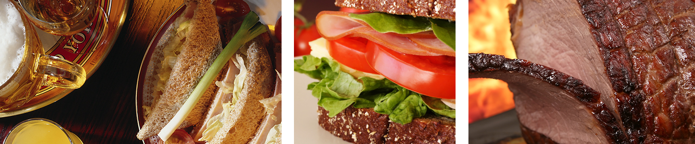

# Eating

Buratta's has a growing reputation for beautifully prepared delicious food freshly made in our modern Kitchen by head chef John Davies. We can cater for any size group, call us on 01199 00187 to discuss your party's needs.

### Menus

We have two main menus:

*   Our bar snacks menu, which serves pub classics and nibbles. It is available lunchtimes and evenings (except for some very busy Friday and Saturday nights when our chef may need to stop serving bar snacks).
*   Our a la carte menu is available lunchtimes and evenings and is always changing depending on the season. You can see our current [menu here](#). We suggest that parties of 10 or more people order their food when they book.

### Sundays

On Sundays we serve traditional roast dinners with all the trimmings and our full bar snacks menu.

### Quality

All our meat, fish and produce are bought from local suppliers and we are well known for only using the finest ingredients. We have a wide range of wines and local beers to match to the food so you will definitely want to come and enjoy a meal with us – whether for the first time or you are one of many happy returning customers!

### Special occasions

Please call us to ask about our Christmas menu. We are also happy to cater for weddings and business events. If you have any special requests don’t hesitate to call on 01199 00187

---
section: sidebar_section
---

**Call us now to make a reservation: 01199 00187**

## Opening hours

**Monday:** Noon - 3PM
Food served until 2.30PM

**Tuesday to Saturday:** Noon - 3PM & 6PM – 11PM
Food served until 2.30 & 9.30PM

**Sunday:** Noon – 4PM
Food served until 3PM
