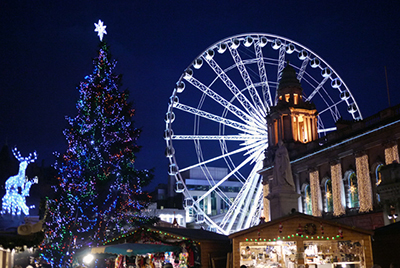
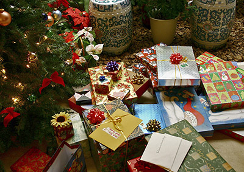

# Christmas variations

_28.01.2017_

**by Ian Glenn**

Wales is one of the four countries that make up the United Kingdom of Great Britain and Northern Ireland and the Christmas celebrations here are similar to those in the rest of the UK. Christmas is celebrated on December 25.

<left></leftt>

In the days leading up to Christmas, a small tree is beautifully decorated with colourful lights and trinkets and set up inside the house. Paper decorations of various colours and sprigs of mistletoe and holly are used to adorn the interiors of houses. Mistletoe is believed to protect the home from evil and holly stands as a symbol of eternal life.

'Eisteddfodde' or carolling is the most pleasurable activity of the Welsh Christmas. The Welsh are great lovers of music and every year they throng to local churches in large numbers to sing carols during Christmastime. These are sung often to the accompaniment of a harp. In many places, groups of people set out at dawn on Christmas morning, going from house to house and carolling before the doors and windows of the houses they visit. Families wake up and usually ask them in for refreshments.

Every year, new carols are submitted by thousands of enthusiastic carollers in the hope that their composition will be accepted for the Welsh list of popular carols. During Christmas, many people gather in public for the announcement of the winner of the annual prize for the best music for a new carol, and the formal pronouncement of it as the carol of the year.

On Christmas Day, people in many parts of Wales wake up very early to attend a special church service that is held between 3am. and 6am. Men gather in local churches to sing (mainly unaccompanied) three- or four-part harmony carols in a service that lasts for nearly three hours. These days, the custom is observed mainly in rural areas. The service over, feasting and drinking begins and continues for the entire day. Gifts are exchanged later during the day. The Christmas meal traditionally consists of roast turkey with different vegetables, followed by a delicious pudding.

Nowadays, Scottish people celebrate Christmas on 25th December, but it wasn't always like that. The tradition of celebrating Christmas was banned here for nearly 400 years until the 1950's. In the 1580's, this magical festival was removed from the list of Scottish festivals since it was considered to be supporting Romanism. Prior to 1958, when Christmas Day was declared a public holiday, it was a normal working day although the children did get presents. The Christmas traditions in Scotland are similar to that of the US, although Scottish people do have some interesting customs of their own.

<left></left>

During November and December, shops here display a variety of gifts for Christmas. As the days pass, multicoloured lights are put up on the trees in towns and cities. The department stores and buildings are decorated with strings of brilliant Christmas lights. Children join in the countdown by making Advent calendars, which mark the days before Christmas Day. These calendars have 24 little doors and one is opened each day to reveal the picture behind, the last one being for Christmas Eve. Young children write a letter to Santa Claus mentioning all the presents they want for Christmas. Families decorate their homes with Christmas trees, colourful Christmas lights, tinsel and other decorations.

Christmas Eve has its own traditions. For example, some people burn the wood of a rowan tree, which signifies that any bad feeling between friends or relatives has been put aside for Yuletide. It is believed that if the fire goes out on Christmas Eve, the household will have bad luck in the coming year. Many children hang up stockings before going to bed so that Santa can fill them with presents during the night.

There is special food on Christmas Day, including black bun (a cake made from fruits, almonds, spices and a little whisky) and Bannock cakes (made of oatmeal). Other delicious dishes are plum pudding, mince pies, spiced roast duck, smoked salmon or prawns and seafood served with a spicy sauce. Some people who do not like fruit cake replace it with a Yule log, which is a chocolate cake that originated in Sweden.
