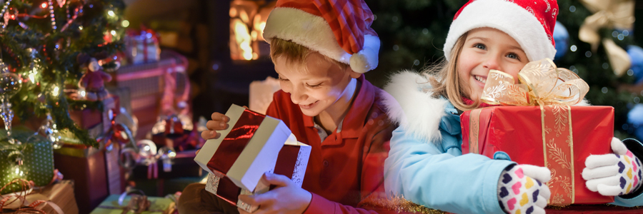
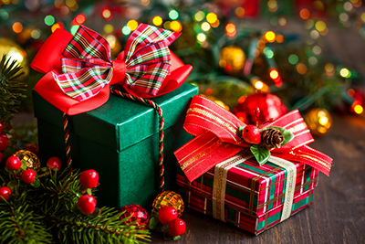
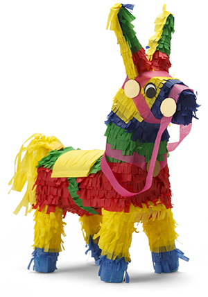

# PROVOCATIVE PROPOSAL: Citizenship education should be abandoned

## Christmas around the world

**by Alvin Derski**

Christmas is the happiest and busiest time of the year for millions of Christians throughout the world. People of different countries celebrate the holiday in various ways, depending on national and local customs. Many people are familiar with aspects of the Christmas celebrations in the US and other English-speaking countries, so here we describe how Christmas is celebrated in some other countries.

## Europe

In France, children put their shoes in front of the fireplace so Père Noël (Father Christmas) can fill them with gifts. Many families attend midnight Mass and then have a festive supper called Le reveillon. Large numbers of French families also decorate their homes with small Nativity scenes. In these scenes, the story of Jesus's birth is portrayed by clay figures, which are bought at special holiday fairs that are held before Christmas.

In Germany, Saint Nicholas visits children's homes on Saint Nicholas's Eve, December 5, and delivers candy and other sweets to be opened on December 6, Saint Nicholas's Day. According to one tradition, the Christkind (Christ child) sends the gifts on Christmas Eve. This tradition is most popular in the mainly Roman Catholic region of southern Germany. In the northern, mainly Protestant areas, parents usually say the Weihnachtsmann (Christmas Man) brings the gifts. Most German families have a Christmas tree that they decorate with lights, ornaments, and tinsel. Spicy cakes called Lebkuchen are made in various shapes and used as decorations.

In the Netherlands, Belgium and Luxembourg, according to legend, Saint Nicholas gives presents to children on Saint Nicholas Eve, December 5, which they open on December 6, Saint Nicholas's Day. Wearing a red robe, he arrives on a boat from Spain and rides down the streets on a white horse. His servant, Swarte Piet (Black Pete), accompanies him. Saint Nicholas goes down the chimney of each house and leaves gifts in shoes that the children have put by the fireplace.

In Italy, most homes and churches have a presepio (Nativity scene). On Christmas Eve, the family prays while the mother places a figure of the Bambino (Christ child) in the manger. Many Italians serve eel for dinner on Christmas Eve. They also bake a Christmas bread called panettone, which contains raisins and candied fruit. Italian children receive gifts from La Befana, a kindly old witch, on the eve of Epiphany.

In Poland, people attend Pasterka (Shepherd's Mass) at midnight on Christmas Eve. Many Polish families follow the Christmas tradition of breaking an oplatek, a thin wafer made of wheat flour and water. Nativity scenes are stamped on the oplatek. The head of the family holds the wafer, and each person breaks off a small piece and eats it. The Christmas Eve meal features fish, sauerkraut, potato pancakes and beet soup.

## Latin America

The nine days before Christmas have special importance in Mexico. These days are called posadas, which means inns or lodgings. On each day, Mexicans re-enact Mary and Joseph's search for lodgings on the first Christmas Eve. Two children carrying figures of Mary and Joseph lead a procession of people to a particular house. The people knock on the door and ask for lodgings. They are refused at first but finally are admitted.

After each posada ceremony, Mexicans feast and celebrate. Children enjoy trying to break the pinata, a brightly decorated paper or clay figure containing candy and small gifts. The pinata may be shaped like an animal, an elf, a star, or some other object. It is hung from the ceiling, and the children take turns trying to hit it with a stick while blindfolded. When someone breaks the pinata, the gifts and candy fall to the floor, and the children scramble for them.

In Venezuela, people have a late supper after returning from midnight Mass on Christmas Eve. Most of these meals include hallacas, which are corn-meal pies stuffed with chicken, pork, beef and spices. A favorite Christmas dish in Argentina is niños envueltos (wrapped children). It consists of rolled slices of beef filled with seasoned minced meat.

## Africa and Asia

In Africa, as in Asia, the celebration of Christmas is not widespread because most of the countries have a small Christian population. Missionaries brought Christmas customs to Africa and so people in the Christian communities generally follow Western traditions. However, Africans sing carols and hymns in their own languages.

## Links
