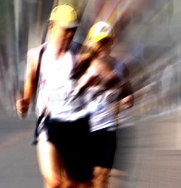

# Skyrise Chicago

**By Steve Smith**
***

***
November 14 2010 (Chicago) - On Sunday morning climbers were taking up the challenge of climbing to the top of the Willis Tower. This is the tallest climb in all of the western hemisphere and takes place right here in the heart of Chicago.

Entrants to the "Skyrise Chicago" event had to climb all of the tower’s 103 floors or do the equivalent on a hand cycle. It is a charity event with all of the proceeds going to the Rehabilitation Centre Chicago.

One of these climbers was Jeff Barnes, who made a team with his brother, sister and friends. The team was called 'Team Brenda' to celebrate his mother, Brenda Barnes. Brenda Barnes was the former chief executive officer of Sara Lee and was treated at the Rehabilitation Centre Chicago after she suffered a stroke.

Jeff spoke live to our correspondent about Skyrise Chicago and the great work that takes place at the Rehabilitation Institute.