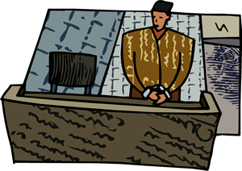

## TRUE CRIME STORIES

### How science helps justice

**DNA Profiling – the first use in a real criminal case**

_The first time DNA profiling was used, it proved innocence - not guilt!_

***

>Sir Alec Jeffreys, a genetic scientist at Leicester University in Great Britain, created a new technique in 1984 - a technique that would enable criminal forensics to take a giant step forwards in solving crime. He called this technique DNA Fingerprinting, but it is now better known as DNA Profiling. This technique quickly became an essential tool which redefined the boundaries of criminal prosecution - indeed, it was to get its very first test in the place where it was created, where a serial killer was on the loose....

***
#### The first crime took place before DNA Profiling

Everyone in the small town of Narborough, Leicestershire, was shocked on November 22, 1983, when Lynda Mann, a fifteen-year old local girl, was found raped and strangled just a few miles from her home. Police immediately mounted a search with 150 officers, but nothing was uncovered and evidence was slim. The only thing that the forensic teams could find at the crime scene was a very small amount of semen. The case would remain unsolved for four years.

#### The second did not

Then, on July 31, 1987 another 15-year-old girl was found raped and strangled just a very short distance from where Mann’s body had earlier been discovered. Her name was Dawn Ashforth. There seemed to be very few differences between the two cases, and so detectives started to look for the same killer. After a very large manhunt, the investigation focused on 17-year-old Richard John Buckland. Though he originally denied any involvement, Buckland later confessed to Ashforth’s murder but refused to acknowledge guilt for Mann’s killing four years earlier.

#### A detective has doubts

Detective Chief Superintendent David Baker was worried by the boy’s confession to one murder and not the other. John Buckland would have been just 14 years old when Lynda Mann was killed. A child-psychologist expressed belief at Buckland's innocence; and then, by chance, Det. Baker remembered about a new technique that had not yet been used in real life forensic investigations, a technique perfected by University of Leicester professor, Sir Alec Jeffries and which he called DNA Fingerprinting.

#### DNA Fingerprinting is used for the first time

The DNA Fingerprinting procedure had never been used forensically, but it was to prove Buckland’s innocence. Samples of the semen which had been found at the scenes of the crime were compared to samples taken directly from Buckland. The results confirmed Det. Baker's suspicions; Buckland was innocent and detectives were forced to renew their search.

Detectives concentrated on the small village of Narborough and two nearby communities. They gathered semen samples from over five thousand men and teenagers. Not one sample was a match to the DNA extracted from the semen at the crime scenes. There was a frenzy of media reporting about the new procedure, the murders and the extensive gathering of samples - but the months passed and the case dominated Leicestershire news.

However, one day the manager of a local bakery reported overhearing a conversation between two men. One man boasted that he had paid a friend to take his DNA test for him - and the suspicious bakery manager alerted the police. They arrested and tested Colin Pitchfork, who was already well-known to the police because he had a history of indecent exposure arrests.

Pitchfork knew he was finished - he confessed to both murders before the test results came back. Results which confirmed his guilt in both murder cases.

Photo: [Alec Jeffreys by Jane Gitshier, PloS.](http://en.wikipedia.org/wiki/File:Aleci-Jeffreys.jpg)
