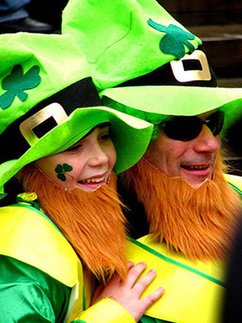
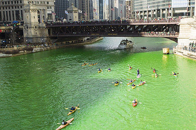

# St Patrick’s Day Around the World

by Maureen Flanagan

St. Patrick’s Day has been a cause for celebration in the US ever since the early 17th century. Every March the 17th, cities and towns across the country pay tribute to the 'Emerald Isle'. The rivers in Chicago are dyed green, while New York City's famous parade draws two million spectators. Elsewhere, communities all around the world are adding their own distinctive twists to the traditional St. Patrick’s Day festivities. Here are some examples from America and elsewhere.

**New London, Wisconsin, USA** - St. Patrick’s Day in New London begins when members of the town's Shamrock Club mischievously change highway signs so that they read 'New Dublin', an idea which met with laughter and eventual council approval over 20 years ago. While the town was originally a German settlement, later waves of Irish immigrants had a huge impact on the town’s customs and traditions. St. Patrick's Day nowadays features Irish food on the menu at restaurants throughout the town, as well as visits by Irish carolers and Shamrock Club members to the senior citizens' home and the local hospitals and schools respectively.

The town of 7,000 manages to squeeze in 30,000 for the parade, which includes the staging of an Irish play, bagpipe players and the town's high school band marching down the street, pursuing a shamrock trail painted on the pavement. It all culminates in the 'Irish Fest', which features Celtic bands such as Rising Gael and Seven Nations performing for visitors in a huge heated tent.

**O’Neill, Nebraska, USA** - The world's largest shamrock is painted in the middle of the road at the intersection of Route 281 and Highway 20, reminding visitors to the town of O’Neill's status as the official Irish capital of Nebraska. John O'Neill, the man after whom the town was named, was a native of Ireland and a key figure in the wave of Irish immigration to Nebraska and the northern US mid-west. His pamphlets, which he distributed to immigrant workers in the coal mines of Appalachia, Pennsylvania, promoted the prospect of owning and farming areas of land further west in Nebraska.

St. Patrick’s Day in O'Neill pays homage to its Irish forebears through a variety of festivities, including a hypnotist and the Children’s Literature Festival. 'In March, everyone just steps a little higher and smiles a little broader,' states City of Commerce member Pat Fritz. What's more, the celebrations don't end on St. Patrick’s Day - residents put on green for the 17th of every month that follows it too!

**Brisbane, Australia** - Nearly 30 percent of Australians claim some degree of Irish heritage and, according to the Australian Embassy in Ireland, there are more than 50,000 Irish nationals living in Australia. One of the main celebrations is The Queensland Irish Association parade which portrays 'The Irish Historical Story'; the story of how Irish men, women, boys and girls from all walks of life helped to build Australia. The march through the main streets of Brisbane City includes residents dressed as an array of ancestors including widows and orphans, lawyers, teachers, gold miners, sugarcane cutters and farmers.

**Banwen, Wales** - According to members of the Banwen & District History Club in Wales, the patron saint of Ireland was not Irish at all, but a local Welshman. Their historians claim that St. Patrick was actually born in Banwen in 385 A.D. and grew up there before being kidnapped by pirates in his teens. They state that he was then ultimately sold into slavery in Ireland. On St.Patrick’s Day, Welsh pipers join members of the organisation in a parade through Roman Road in the town and ending at a stone commemorating St. Patrick’s birthplace.

**Ise, Japan** - The Ise Shrine, an important Shinto monument dedicated to the sun goddess Amaterasu, acts as the starting point for marchers at Ise's annual St. Patrick’s Day celebration. The parade begins with the Japanese and Irish flags flying side by side while Japanese revellers do Irish dances, play bagpipes and dress up in Irish costumes to entertain the children. More than 500 marchers, among them the Irish Ambassador to Japan, take part in the festivities. Following the celebrations, participants proceed to bake shellfish as part of an oyster festival which celebrates commerce in the region. The Irish Network of Japan co-organises the event, in addition to events in Tokyo, Okinawa and in other locations around Japan, in order to promote cultural exchange between the two nations.
