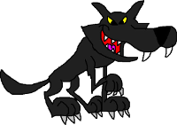

# Little red riding hood

**O**nce upon a time, there was a little girl who lived near the forest. Her mother made her a cloak with a big red hood to keep her warm. The girl loved the cloak and always wore it when she went out and so she came to be known as “Little Red Riding Hood”.

One day, Little Red Riding Hood’s mother said to her, “Take this basket of food to your grandma’s cottage, but be careful - don’t talk to strangers on the way!” Promising not to, Little Red Riding Hood skipped off. On her way through the forest she met the Big Bad Wolf.

 <b>“Where are you going, little girl?”</b> he asked.

 <b>“To my grandma’s house, Mr. Wolf! She lives in the cottage on the other side of the forest”</b> she answered.

**T**he Big Bad Wolf then ran very fast to her grandmother’s cottage and knocked on the door. When Grandma opened the door, he rushed in and locked her up in the cupboard. The wicked wolf then put on Grandma’s clothes and lay in her bed, waiting for Little Red Riding Hood to arrive.

When Little Red Riding Hood reached the cottage, she entered and went to Grandma’s bedside.

  <b>“My! What big eyes you have, Grandma!”</b> she said in surprise.

 <b>“All the better to see you with, my dear!”</b> replied the wolf.

 <b>“My! What big ears you have, Grandma!”</b> said Little Red Riding Hood.

 <b>“All the better to hear you with, my dear!”</b> said the wolf.

 <b>“What big teeth you have, Grandma!”</b> said Little Red Riding Hood.

 <b>“All the better to eat you with!”</b> growled the wolf and pounced on her.

**L**ittle Red Riding Hood screamed and the woodcutters in the forest came running to the cottage. They beat the Big Bad Wolf and rescued Grandma from the cupboard. Grandma hugged Little Red Riding Hood with joy.

The Big Bad Wolf ran away and was never seen again. Little Red Riding Hood never spoke to strangers ever again - she had learnt her lesson.

