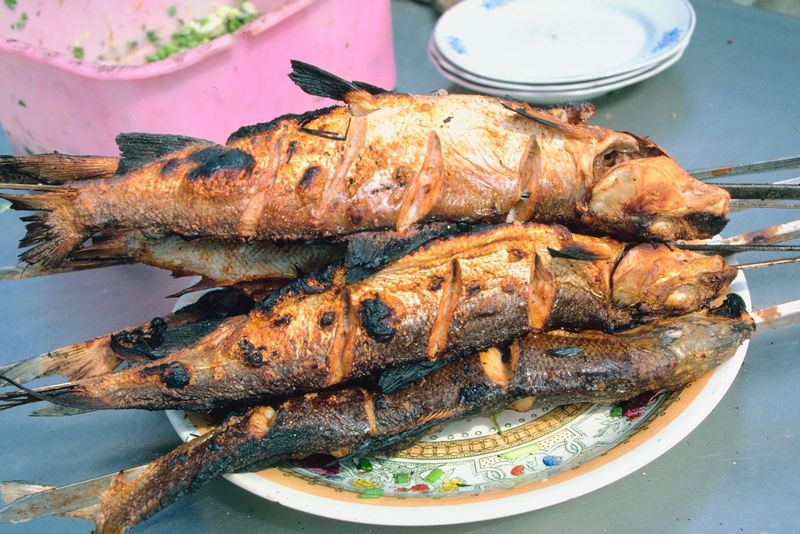
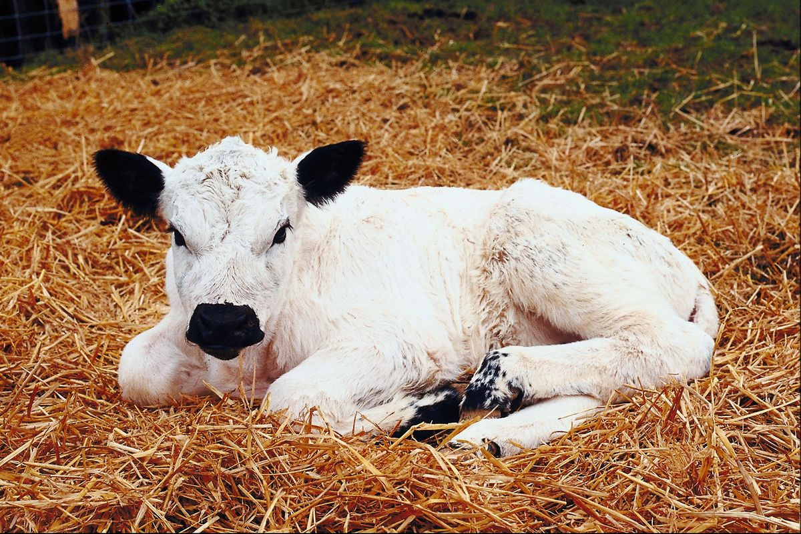

# What you eat depends on where you belong
## by Marie Wang

In many countries or communities, the types of food that are eaten depend on tradition, availability, cost and personal taste. As for tradition, typically there are foods that can be eaten at any time but there are others that are reserved for certain periods of the year or for particular holidays or festivals. In addition, some social groups, particularly religious communities, have fixed rules concerning the consumption of certain foods, or of foods not prepared in a specific way.

Two such religions are Islam and Judaism; Muslims use the word 'halal' for the foods that they are allowed to eat, while the corresponding Jewish term is 'kosher'. The two faiths have several things in common; for example, they both forbid meat from pigs and they both allow meat from sheep, goats or cows, provided the animal has been slaughtered (killed) in a prescribed way. Hindus, on the other hand, consider cows as sacred and so eating their meat is forbidden. However, this taboo does not extend to dairy products. Quite the contrary; dairy items such as milk, yoghurt and ghee (clarified butter) are highly revered and used in religious ceremonies. Many Hindus, particularly Brahmins, are vegetarian, abstaining from eating the flesh of any living creature.

A common explanation for the fact that pigs are widely considered unclean in the Middle East is that they are omnivorous, not discerning between meat and vegetation in their natural dietary habits. Their willingness to consume meat sets them apart from most other domesticated animals which are commonly eaten (cows, horses, goats, etc.) since these would naturally eat only grass and plants. In spite of the fact that pork is forbidden in certain religions, it is still the most widely eaten meat in the world.

In modern times, eating beef has gained some acceptance in various parts of India, despite the opposition of most Hindus. The slaughter of cows is an extremely provocative issue for Hindus. Most of the beef in India is consumed by Muslims and Christians.

Some ethnic Chinese may also refrain from eating cow meat, because many of them feel that it is wrong to eat an animal that was so useful in agriculture. Some Chinese Buddhists discourage the consumption of beef, although it is not considered taboo. A similar reluctance can be seen among Sinhalese Buddhists, who consider it to be ungrateful to kill the animal whose milk and labour provide a source of livelihood for many Sinhalese people.

Venison (the meat from the deer) has a long association with royalty and aristocracy. Among the upper classes in England in the 16th and 17th centuries it was often given as a Valentine's Day present. These days, several species of deer are farmed for their meat. Caribou or reindeer is popular as a dish in Alaska, Norway, Sweden, Finland, Russia and Canada, but it is unusual in the United Kingdom and Ireland. This may relate to the popular culture myth of the reindeer as assistants to Father Christmas.

As for dogs and cats, in all Western countries eating the meat of any type of animal commonly kept as pets or companion animals is generally considered taboo, though that taboo has been broken under threat of starvation in the past. However, in some rural areas of Poland, dog fat is believed to have medicinal properties - being good for the lungs, for instance.

According to the ancient Hindu scriptures, dog meat was regarded as the most unclean food possible. In contrast, in Mexico during the pre-Columbian era (roughly before 1500) the meat of a hairless dog was commonly eaten. After colonization, this custom stopped. In South-east Asia, most countries, excluding Vietnam, rarely consume dog meat either, because of Islamic or Buddhist values or the belief, in the Philippines for instance, in the rights of animals.

Among the Somali people, most clans have a taboo against the consumption of fish, even some of those who live on the coast, and do not intermarry with the few clans that do eat it. Jews consider fish to be kosher but not shellfish or octopus. In Islam there are different opinions as to whether shellfish is halal or not.

Horse meat is part of the cuisine of countries as widespread as Japan, France, Germany, and Kazakhstan, but is taboo in some religions and many countries. It is forbidden by Jewish law; in Islamic law, the eating of horse meat is not forbidden but it is strongly discouraged. It is forbidden in Hinduism.

Horse meat is generally taboo in English-speaking countries. In Canada, horse meat is legal, but there is only really a market - and that a small one - in the French-speaking province of Quebec, where the taboo is not so strong, and in a few (mostly French) restaurants elsewhere.
