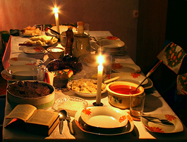
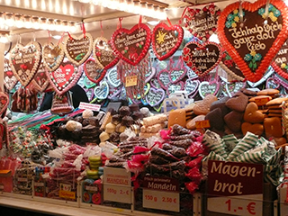
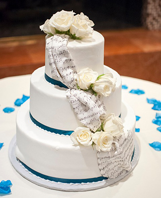
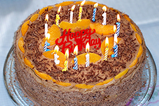

# Food for festive occasions

## by Willy Atwell

Celebrations take place in every culture and country on every continent. They bring people together, maintain cultural identities, and strengthen community bonds. One crucial aspect celebrations worldwide all have in common is the vital role played by food. Special occasions - such as Christmas, New Year, weddings and birthdays - all feature the prominent use of a variety of different dishes, regardless of location.

The British Empire has had a great deal of influence over the development of many Christmas customs around the world. Mistletoe and Christmas cards both originated in the British Isles and then spread to the colonies in Australia, New Zealand and South Africa. This led to many similar Christmas customs in these countries, including many types of festive food such as mince pies and fruit cake. However, probably due to the hotter weather experienced by Australians on Christmas Day, it is becoming increasingly popular to enjoy seafood, rather than roast meats and ham, there on Christmas Day.

Traditional Christmas foods differ greatly from one location to the next. This is largely due to local availability and cultural significance. Some examples include:

*   Germany - also keen on sweets, in this case gingerbread biscuits and liqueur chocolates.
*   France - black pudding, a type of sausage which contains blood, is widely eaten.
*   French Canada - the emphasis is on desserts such as doughnuts.
*   Russia - the celebration revolves around a feast of twelve individual dishes, representing Christ’s disciples, which everyone shares.
*   Nicaragua - the main dish consists of chicken with a tomato, onion and papaya stuffing.

Traditional foods for New Year around the world include:

*   Greece - a special sweet cake is baked which has a coin inside it.
*   Japan - A week before the celebration, as many as twenty special dishes are prepared. Each dish symbolises a New Year’s wish - for example, seaweed represents happiness in the year ahead.
*   Scotland - the national dish, haggis (stuffed sheep’s stomach), is eaten and then followed by scones and gingerbread biscuits.
*   Spain - twelve grapes, which are eaten one by one at each chime of the clock at midnight.

However, a number of countries in Asia don't celebrate the New Year on January 1, but upon sighting the first full moon in the first Chinese lunar month. Traditional New Year’s food in Asia includes:

*   China - different fish and chestnuts dishes and various fried foods are most popular.
*   Korea - the main dish is a dumpling soup.
*   Vietnam - rice cakes filled with meat are served alongside sharkfin soup.

Weddings around the world share a lot of common ground regardless of the religion or culture. In most countries, weddings are joint celebrations for the two families that include a wedding cake and an array of traditional food.

Foods that commonly feature at weddings include:

*   China - roast pig, pigeon, lobster, fish, chicken and a kind of bun which is stuffed with lotus seeds. Above all, it is important to offer both lobster (which represents the dragon) and chicken (which represents the phoenix), as it is believed to harmonise the Yin and Yang of the newly-joined families.
*   Italy - food is an essential part of the Italian wedding. Twists of dough are fried, sprinkled with sugar, and then eaten by the bride and groom for good luck. A roast pig or lamb is often served as the main dish, and is accompanied by various types of pasta and fruits. The traditional Italian wedding cake is unlike traditional ones elsewhere as it is made from biscuits.
*   Korea - noodles, which represent longevity, are always served.
*   Norway - a traditional wedding cake made of bread and topped with cream, cheese and syrup.

The origins of the birthday party were in medieval Western Europe, when it was thought that friends, family members, festivities and presents could fight off evil spirits associated with birthdays. Traditional types of food prepared for birthdays around the world include:

*   Australia - birthdays generally feature a decorated cake with candles. The candles are lit and the person celebrating the birthday blows them out while also making a wish.
*   Ghana - the birthday child’s breakfast includes a fried patty made from a blend of mashed sweet potato and eggs. Later, the birthday party features a dish made from fried plantain (a type of banana).
*   Korea - On its first birthday, a child is dressed smartly and then a number of objects are placed in front of it. These include rice, fruit, brushes for calligraphy and some money. The item which the child picks up symbolises their predicted future; for example, picking up rice would indicate a future of material wealth.
