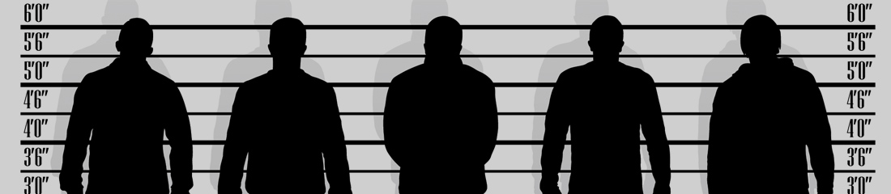

# Eyewitness Testimony: The Case of Gary B Megson

_by Cheryl Goldstein - Posted on June 17th, 2016_

On 27 June 2001, a bank in Pasadena, California, was robbed. The two thieves made off with around two thousand dollars in cash.

Gary B. Megson, a 34-year-old from Los Angeles, was at that time in violation of parole. He had spent two years in a California prison for selling stolen cars, but had been released in late 2000, on condition that he did not leave the state of California. Megson had dropped out of high school at the age of 15 and had become involved with gangs, but he now wanted to get away from the world of crime. Accordingly, he crossed the border into Arizona and moved in with his girlfriend in Las Vegas. There he took odd jobs to make ends meet and told his parole officer that he was staying with his parents in a Los Angeles suburb. Occasionally, he had to drive rapidly from state to state to attend parole meetings.

One day in September 2001, Megson turned up for an impromptu parole meeting he had been called to. However, it was not the parole officer, but a police officer, that met Megson at the office, together with a warrant for his arrest. Megson had been identified by two witnesses who had been working at the Pasadena bank at the time of the robbery.

At his trial, Megson's alibi in Las Vegas did not hold up, and he and another man, Jackson Filch, were found guilty of robbery on the basis of eyewitness testimony.

"The trial was a farce," Megson's mother, told reporters. "They seemed more interested in talking about Gary's past gang activity than the crime at hand,". She related that, at one point in the trial, the prosecutor asked Megson to show his tattoo, displaying his status as a member of the notorious Devil's Disciples gang, to the courtroom.

Groups working for criminal justice reform in the United States describe Megson's case as a classic example of the problems caused by America's reliance upon eyewitness testimony. Their main argument is that, despite the fact that eyewitnesses' memories are easy to manipulate, the testimony of a single eyewitness can still outweigh a huge amount of additional, and often contrasting, evidence during trials.

In Megson's case, the two main witnesses were employees of the bank that was robbed, Tamara Lopez and Marco Perreira, neither of whom remembered the event or its perpetrators in detail. In fact, according to their statements to the police, the only thing they could recall was that both men were black. Perreira specifically told detectives investigating the robbery that he would not be able to identify the robber who had hit him and told him to lie face down on the ground. Nevertheless, when presented with a choice of 48 mugshots, both Lopez and Perreira picked Megson as one of the suspects.

At the trial several months later, Lopez seemed not to recognise Megson, telling the court "I'm completely sure that's him in the picture, but I'm not sure if that's him sitting over there."

After a brief meeting with the prosecutors, in which she was asked to look at the mugshot one more time, Lopez returned to the witness stand and stated that she had been mistaken and Megson was in fact one of the men who had robbed the bank. Megson was found guilty and sentenced to 30 years' imprisonment for armed robbery.

Following his imprisonment, Megson's parents sold their house, hired a private investigator and devoted their time and money to attempting to find the real culprits. Two years later, they got extra help from the Innocence Project, a national organization dedicated to helping prisoners who have been wrongfully convicted.

By 2010, the two real perpetrators had been tracked down and had confessed to the crime. In addition, Jackson Filch, who had claimed to be innocent at his trial, admitted that he had organized the robbery but not taken part in it, and that Megson had not been involved at all.

Megson, who has managed to complete his high school degree while in prison, is still waiting for a decision on whether he will receive a new trial.

