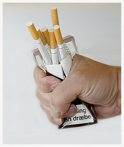

# Top 10 New Year's Resolutions

New Year has always been a time for reflecting on the past year and, more importantly, looking forward to the coming one. It's a time to think about the changes we want (or need) to make in our lives and to resolve to make those changes happen.

These are our top ten New Year’s Resolutions. Do any of yours feature in this list?

## 1\. Spend More Time with Family & Friends

Recent polls show that more than 50% of Americans resolve to appreciate the people they love and to spend more time with family and friends this year. Make plans to meet up with friends for an evening at a local restaurant, or take the family for a day out somewhere special. Work shouldn't always come first!

## 2\. Make Time for Fitness

Regular exercise provides more health benefits than anything else. We all know that exercise helps you achieve and maintain weight loss. Studies show that it can also reduce the risk of developing certain types of cancer, increase longevity, improve mood, lower blood pressure, and alleviate arthritis. Essentially, exercise keeps you healthy and makes you look and feel better.

## 3\. Fight the Fat

Over 66 percent of adult Americans are believed to be overweight or obese according to recent studies, so it's hardly surprising to find that weight loss is one of the most popular New Year's resolutions. Setting achievable goals and staying focused are the two most important factors in sticking with a weight loss program.

## 4\. Quit Smoking

If you have decided to make this the year that you put an end to your smoking habit, you've done so at the right time as quit-smoking aids have never been more accessible. Even if you've tried to quit before and failed, don't let it get you down. On average, smokers make about four attempts before they manage to quit for good. Start enjoying the rest of your smoke-free life!

## 5\. Enjoy Life More

Given our increasingly stressful lifestyles, it is no surprise that "enjoying life more" has become a very popular resolution in recent years. Why not try visiting a holistic healing center for treatments designed to bring balance to your body, mind and soul? Or just get out there and try something new! Take up a new hobby, go to a theater performance, or head to the local spa.

## 6\. Quit Drinking

While many use the New Year as an incentive to finally stop drinking, most people are not ready to make such a radical lifestyle change all at once. Many heavy drinkers fail to quit cold turkey but do much better when they make the change gradually. If you have decided that you want to stop drinking, there is a world of help and support available – such as through Alcoholics Anonymous meetings, which are held throughout the world.

## 7\. Get Out of Debt

Was money a big source of stress in your life last year? Join the millions of Americans who have chosen to spend this year getting a grip on their finances. It's a promise that will repay itself many times over in the year ahead.

## 8\. Learn Something New

Have you vowed to make this year the year to learn something new? Perhaps you are thinking about a change of career, want to learn a new language, or just how to fix your computer? Whether you take a course or read a book, you'll find education is one of the easiest and most motivating New Year's resolutions to keep. "Lifelong learning" courses are offered in almost all colleges and universities, and the majority also offer distance and adult education programs.

## 9\. Help Others

A popular, selfless New Year's resolution, voluntary work can take many forms. Whether you choose to spend time helping out at your local library, tutoring a child, or building a house, there are many non-profit volunteer organizations that could really use your help. Most organizations make it easy by connecting each volunteer with projects designed to fit practically any schedule.

## 10\. Get Organized

Whether you want your home tidy and clean so that you can invite someone over at short notice, or your office organized enough that you can find the stapler when you need it, better organization can be a very achievable goal. You can even have it done by professionals who can help you reduce the clutter and find peace in your home.
