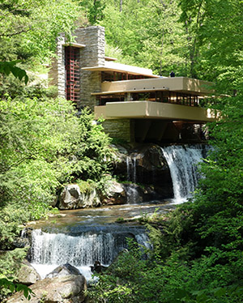

# Fallingwater

## Pennsylvania, USA [1964]

Fallingwater is a house which Frank Lloyd Wright designed for the rich Kaufmann family and finished in 1964\. It is located in woodland near a waterfall in Pennsylvania. It has a geometric design which fits naturally above the flow of the stream. It has large terraces, and most of the house is made from stone. Many experts believe that Fallingwater is the "best all-time work of American architecture".
