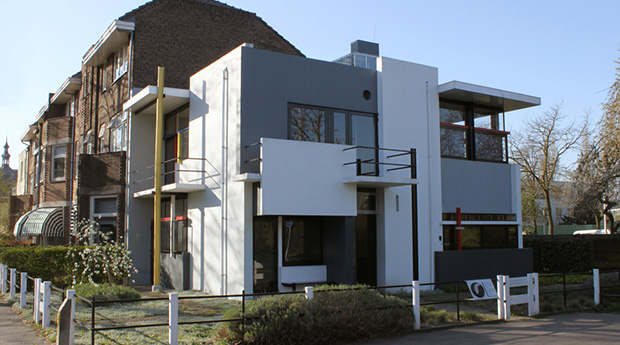

# Rietveld Schröder House

## Utrecht, Netherlands [1924]

The Rietveld Schröder House was designed by the architect Gerrit Thomas Rietveld, and built in the city of Utrecht in 1924\. It is a small family house that was influenced by the ideals of the De Stijl group of artists and architects in the Netherlands in the 1920s. The house is now a museum open for visits and has been a UNESCO World Heritage Site since 2000.
