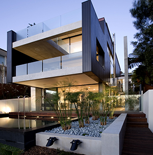

# Whale Beach House 2

## Sydney, Australia [2008]

This dramatic house was designed by Alex Popov and built in 2008\. It sits next to Whale Beach and has a sea view on each side of the house. Whale Beach House 2 is a three-level building with a large window which frames the beach below. The house is designed for sunny days which fill it with light. It also has a swimming pool as well as a balcony for each of the top-floor bedrooms.
