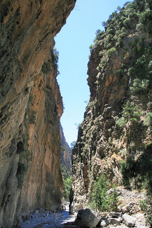
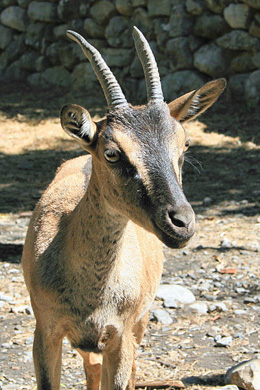

# Samaria Gorge

The Samaria Gorge is situated in the Samaria National Park in the _Lefka Ori_ (White Mountains) of Crete. The National Park was created 50 years ago, in 1962\. Since then the area has been under the protection of the Forestry Department of Hania. The Samaria National Park is home to the Cretan wild goat, known locally as the _kri-kri_, which is a protected species.

The classic walk through the gorge starts at the village of Omalos (1227 metres above sea level) and ends at Agia Roumeli on the south coast (sea level), a distance of 18km.

***
### Opening times of the gorge

The gorge is open to visitors from the beginning of May until the end of October. It is closed in winter because of the danger of rock falls and flash floods. You must leave the park before nightfall; overnight camping is not allowed. There is an entry fee of €5.00 to enter the National Park. There are wardens in the park to help you if you get into difficulties.

***
### How long does the walk take?

This depends on how fit you are! Very good walkers can do the whole walk in about three hours. Older people, children and not very experienced walkers could need up to seven hours. The first 2km are very steep and most of the path is over stones, so the walk is not recommended for people with knee or ankle problems.

***
### Advice for walkers

*   Start as early in the day as possible. In summer it can get very hot in the gorge and for the last 3km of the walk there is almost no shade.
*   Wear proper walking shoes. The path is stony and you could fall or hurt your feet if you don't have good shoes.
*   Take a water bottle with you. There are natural springs inside the gorge so you can refill your bottle when you need to.

***
### Getting there and getting back

Tourist offices all over the island offer organised tours to the Samaria Gorge. This is a good solution if you prefer to walk with an experienced guide and you do not want to go on public transport.

If you want to go alone or with friends, you can take a public (KTEL) bus to Omalos. From there you walk down the gorge and take a boat from Agia Roumeli on the south coast to Hora Sfakion. The KTEL bus from there back to Hania waits for the last boat to arrive from Agia Roumeli.

***
## KTEL bus times and prices

|Route                     |Departure         |Journey time|Frequency|
|:||||
|Hania - Omalos            |06:15 or 07:45    |45 minutes  |Daily    |
|Hora Sfakion - Hania      |11:00 or 18:30 (*)|2 hours     |Daily    |

<small>(*) = After the arrival of the boat from Agia Roumeli</small>
