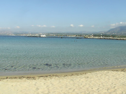

## Other places to visit

The high mountain range of the Lefka Ori (White Mountains) runs from west to east across Hania prefecture. For this reason, transport along the flat north coast is easy and fast, but there are only four major routes from the north coast to the south coast. Travelling along the south coast can only be done on foot or by boat. You can put your car on a small ferry, but this is an expensive and impractical way to see the south coast villages, especially since two of them - Agia Roumeli and Loutro – have no roads at all.

---

[Click to open map of Crete](../../assets/images/haniamicrosite-Map.jpg)

---

### Nearby beaches

The closest beaches to Hania are to the west of the town. These are very popular with local people as well as tourists and can get very crowded, especially in July and August.

### Beaches to the east of Hania

To the east, along the national road, there are regular public buses to the picturesque fishing village of Georgioupoli, which has several sandy beaches. The beaches at Kalives and Almirida are also well worth a visit.

### The west coast

The west coast offers two wonderful beaches with pinkish-golden sand and crystal clear water. _**Elafonisi**_, situated at the south-west tip of Crete, is actually a tiny island separated from the mainland by a shallow lagoon. The island is said to be a breeding ground for the endangered species _caretta caretta_, or loggerhead sea turtle.

Further north, at the base of the Gramvousa Peninsula, is _**Falasarna**_. As well as a superb beach Falasarna also offers an interesting archaeological site - the ruins of the harbour of the ancient city of Falasarna, which flourished from 333BC until about 69BC, when the Romans destroyed it. The remains of a circular tower and parts of the harbour wall can be seen, as well as some tombs and workshops. An unusual geological feature of Falasarna is that, because the west end of the island of Crete is rising, what used to be the harbour wall is now more than 100m inland from the sea.

### Gramvousa peninsula

At the opposite end of the peninsula from Falasarna are two islands, one of which is topped by the ruins of a Venetian fort, which later became a base for pirates and played an important role during the War of Independence against the Turks. Another lagoon is situated at Balos, opposite the two islands. It is possible to reach Balos on foot by walking up the Gramvousa peninsula, but there is no water or shade on the way. An easier way to get there, and also to visit the island with the pirate castle, is by taking an organised boat trip from the town of Kastelli.

### The south coast

The only villages on the south coast that are accessible by road are Paleohora, Sougia, Hora Sfakion and Frangokastello. All of these offer overnight accommodation and can be reached from the town of Hania in a day by car or bus. For the complete experience of the wild and beautiful south coast, put on your walking shoes and go down the [Samaria Gorge](gorge.html) to Agia Roumeli and take a boat east or west from there. Alternatively, you can go village-hopping by boat, starting at Paleohora and going east, or departing from Hora Sfakion and going west.

Kalivaki beach, near Georgioupoli

The island and lagoon at Elafonisi

Falasarna

The lagoon at Balos with the ruined fort of Gramvousa in the background

A church near Loutro, on the south coast

