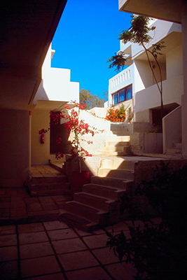
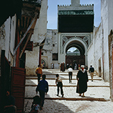
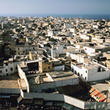
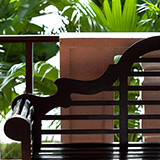
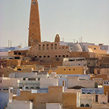
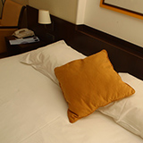
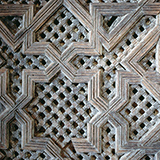
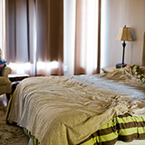
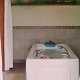
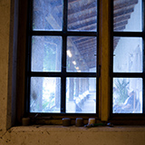

**Overview**  
House Description

Riad al-Hadiqa is a beautiful, traditional riad which offers peace and tranquillity near Essaouira's busy and exciting medina (old town). It is the perfect base for exploring this historic old fishing village and its picturesque surroundings. Guests can sunbathe on the sunny roof terrace, which has amazing sea views, or choose to relax on the nearby beach. On arrival you will be met by Ahmed and our friendly maid Latifa. Ahmed will give you a tour of the town and can arrange other activities and excursions for you.

|    |     |
|:---|:---|
| **Size** | Sleeps up to |
|**Location**|Central Essaouira. Medina – 0.2km / Beach – 2km / Airport – 10km (15 minutes by taxi)|
|**Price per night**|360 dirhams (£24)|
|**Facilities & Utilities**|TV + DVD player, Wi-Fi, Kettle, Iron, Hair dryer, Cooker, Microwave, Fridge, Freezer, Washing machine, Clothes dryer|
|**Rooms**|2 bedrooms (1 triple, 1 double), 2 bathrooms, kitchen, dining area, lounge, courtyard, hall, terrace|

## About Essaouira

Essaouira is a charming ancient medina (walled town), with a 3 mile-long beach and a small picturesque working fishing port. The medina consists of a maze of narrow old streets in which you will find souks selling local crafts, clothes and spices. There are also restaurants offering a variety of Moroccan, French and Italian cuisine. Cars are not allowed inside the medina as it is a UNESCO world heritage site.

## Things to do in the area

There are plenty of activities on offer including windsurfing, walking, cycling, quad biking and camel or horse riding. Fishing day trips can be arranged from the busy little harbour. Car hire or coach trips are available if you want to explore the mountains further inland.

 

