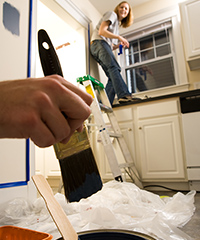
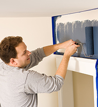

# Planning

Before you start your DIY adventure, it's important to step back and consider the project as a whole. This essential guide has been designed to help you with this process and will ensure you avoid home improvement disasters. By following our tips you can be sure you will feel satisfied with the results of your handiwork, while also saving time and money.

## Budget

If you want to redecorate a bedroom, think about what exactly you plan to do and not do. If you decide to paint the room, will you include the ceiling and woodwork or will you just focus on the walls? Or perhaps you would prefer to use wallpaper? And how about more specific details – will you change the carpet, curtains, upholstery and lighting? All of these decisions depend upon how much money you are able to spend on the project.

A quick repaint of the walls may cost you around £50, but the price can double if you decide to use wallpaper. Even bigger changes will require much more money. Obviously, the choice is yours – if you have the funds, you can achieve just about anything. Just make sure you're aware of what you're likely to spend before you begin.

## Start a file

Unless you're a fan of plain white walls, you'll definitely need to get some colour charts, wallpaper samples and possibly fabric samples to help you make decisions about which products to use.

Nowadays colour charts are easy to find on the internet, but if you want to find samples and speak to somebody in person, staff in high street shops or department stores will be happy to help you. You can pick up free colour charts and request samples of display wallpaper in DIY stores, or try curtain shops for fabric samples. Don't forget you can also get cheap fabrics from local markets and find colour-scheme ideas from monthly home magazines.

We recommend you buy a cardboard folder or file to keep your charts and samples in so that you can refer to them easily.

## Plan your time

Provided you're not hiring professionals, the work involved in the project will cost you nothing. However, you will still need to work out exactly how much time you will need to spend.

People often underestimate the total time needed as they forget that preparation takes time too. Before repainting a room you will need to clear the furniture, take everything off the walls, wash down the surfaces, patch up damaged areas and cover up (or remove) the carpet. Just this preparatory work could take at least a day.

You will probably need a whole weekend to repaint one room, and two will be needed if you are doing something more complicated, such as hanging wallpaper or tiling floors. This may sound like too much time, but it is less stressful to give yourself a realistic timetable for the job.

## Get organised

Finally, make sure you understand all the details of the job as well as any possible problems you may run into. To redecorate a bathroom, for example, you should first do the tiling, then the painting and finally the flooring. But, remember, before you can begin any of the work, you should estimate what materials you need (and how much of them).

By planning all the details first, you'll find yourself able to establish what order things should be done in and consequently be able to organise your shopping and working time effectively. We've made this easier for you by including guides to a variety of DIY projects and a handy paint calculator - see the links on the left.
