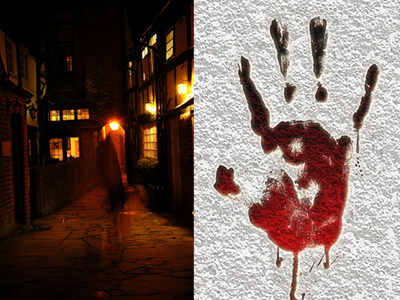
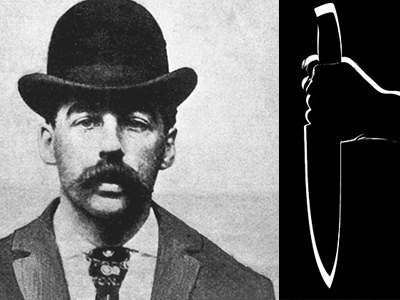
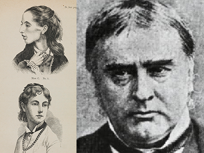
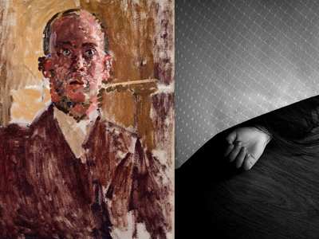
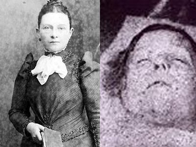

# The Top Five 5 Jack the Ripper Theories

_by Cynthia Johnson - Posted on March 22th, 2015 at 7:26pm_

More than 100 suspects were investigated for the grisly 'Jack the Ripper' murders which took place in Whitechapel between 1888 and 1891\. Among them were a number of unlikely candidates and others who are more difficult to ignore.

Read our five favourite theories and decide for yourself the real identity of the mysterious maniac.

## 1\. The Blood-Stained Shawl

**Who?** Aaron Kosminski - Polish barber and psychiatric patient

**Why?** Recent DNA discoveries found on a shawl belonging to one of Jack the Ripper's victims matches that of Kosminski, who was one of six of the main suspects in the original investigation. This is one of the most popular theories of recent years and has gathered a lot of media interest.

**Read:** Naming Jack the Ripper - Russell Edwards

## 2\. A Tale of Two Cities

**Who?** H.H. Holmes – American doctor, hotel owner and infamous mass murderer

**Why?** Holmes was a mysterious character about whose origins little is known. The one certainty is that he used his Chicago hotel as a location for vicious serial killing. A computer sketch of Jack the Ripper based on witness testimonies appears to bear an uncanny resemblance to 'America's First Serial Killer'. Might he have also been London's most notorious?

**Read:** Bloodstains - Jeff Mudgett

## 3\. Friends in High Places

**Who?** Sir William Withey Gull - Physician to Queen Victoria

**Why?** The leading candidate for the unclaimed title over the years, many believe that Gull was hired to avert a national scandal. It was thought that he used his expert medical knowledge to 'take care of' a Whitechapel prostitute who was pregnant with an illegitimate heir to the throne. In order to do so effectively, he needed to disguise her death in a series of killings.

**Read:** From Hell - Alan Moore

## 4\. A Study in Scarlet

**Who?** Walter Sickert - British painter

**Why?** The artist took great interest in the killings and famously painted a picture of an atmospheric room he rented, which he believed had been used by Jack the Ripper. Modern theories suggest that an unsuccessful operation left the artist impotent and led him to take his frustration out on Whitechapel's most vulnerable inhabitants. The poses of some women in his paintings seem to reflect those seen in police photographs of the Ripper's victims.

**Read:** Portrait of a Killer: Jack the Ripper, Case Closed - Patricia Cornwell

## 5\. Femme Fatale

**Who?** Lizzie Williams - Wife of the royal physician

**Why?** Some suspect Williams of the murders, which they think she may have committed due to an inability to cope with her own infertility. These theorists believe this might have led her to kill and mutilate the bodies of her fertile victims. One famous supporter of this hypothesis was Arthur Conan Doyle, the creator of Sherlock Holmes, who famously wrote about 'Jill the Ripper'.

**Read:** Jack the Ripper: The Hand of a Woman - John Morris
