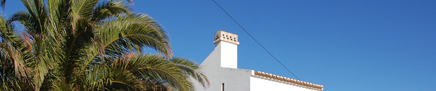

#### Last minute offers! Are you ready for the holiday of a lifetime?

_Due to last minute cancellations, the following 3 villas are available for 1 week from next Saturday._

### Lastest Deals

|    |    |
|:---|:---|
|Seaside escapes at 34 parks |<small>https://holidayhomes.com/deal-1</small>|
|Affordable dream from £11,995 |<small>https://holidayhomes.com/deal-2</small>|
|A UK holiday home is the perfect seaside escape: hassle-free holidays right on your doorstep |<small>https://holidayhomes.com/deal-3</small>|
|We know we have one that suits you to a tee. |<small>https://holidayhomes.com/deal-4</small>|
|Fishing enthusiast? Here's one you're just going to snap at! |<small>https://holidayhomes.com/deal-5</small>|
|Sherwood Forest just a few minutes away: great deals in Nottingham. |<small>https://holidayhomes.com/deal-6</small>|
