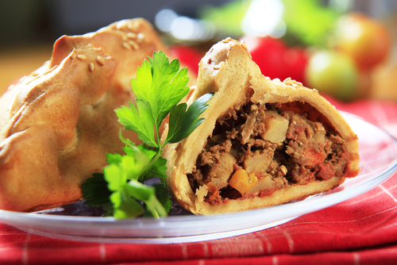
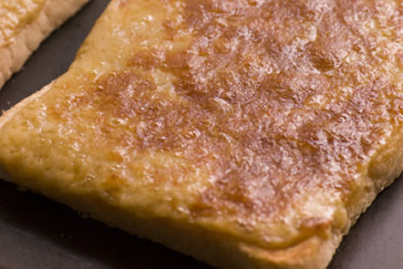
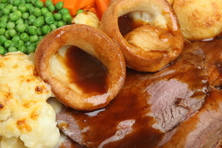
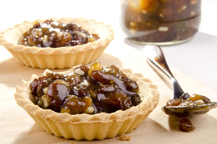
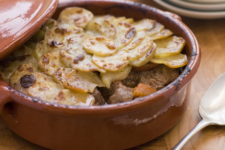
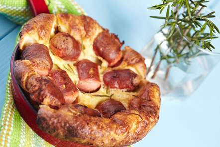

# British food

People from outside Britain often joke that there is no such thing as British food. It is true that lots of British people eat Italian, Chinese or Indian food but there are plenty of “real” British dishes too! Here are seven of the all-time favourites of British cooking.

### Cornish pasty

* * *

This tasty snack is a favourite for a quick lunch in a pub or as a takeaway from a baker's shop. If you want to try making pasties at home, make sure you buy good quality beef and plenty of onions for the filling. Homemade pasties are great for a lunch box or can even be a filling main dish if you serve them with vegetables.

### Welsh rarebit

* * *

Who doesn't love this delicious dish when they need a quick but filling snack? The basic ingredients are toasted bread with a cheese-based mixture on top, but every British family has their own version. Some people put mustard in the cheesy mixture, others even use beer!

### Yorkshire pudding

* * *

Despite the name, this is not a dessert! Yorkshire pudding is the perfect side dish to serve with the classic British Sunday lunch of roast beef. A mixture of flour, eggs and milk is baked to make these little golden puddings that are perfect for soaking up all the delicious gravy from the beef.

### Mince pies

* * *

Another dish with a surprising name! These pies don't contain meat. The main ingredient is mincemeat, a mixture of chopped apples, raisins, other dried fruits and brown sugar. Some families make their own mincemeat, but you can buy it ready made in jars. You put mincemeat in pastry to make mince pies. These are very popular, especially at Christmas.

### Lancashire hotpot

* * *

This dish is a tasty and filling mix of lamb and onions with a topping of sliced potatoes. It is cooked in the oven in a pottery dish. It is a favourite for pub lunches and is also popular for parties because it is easy to prepare and cook for large numbers of people.

### Shepherd's pie

* * *

Another classic British main dish, Shepherd’s pie is easy to make and very tasty. The main ingredients are minced lamb, carrots and mashed potatoes but, as with Welsh rarebit, most families add extra ingredients and have their own favourite version.

### Toad in the hole

* * *

This traditional dish needs a mixture of flour, eggs and milk like the one used for Yorkshire pudding. You add pork sausages to this mixture and bake everything together in the oven. Don't let the strange name put you off – toad in the hole is really delicious!

