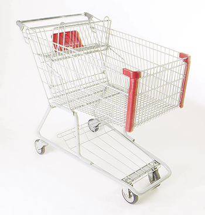

# Buy Nothing Day FAQ

## What exactly is Buy Nothing Day?

Buy Nothing Day (the last Friday of November) is an event that challenges the consumer culture that we live in by asking us not to go shopping for one day. It’s a global protest against consumerism - some celebrate it as a holiday and some even hold street parties! Anyone can get involved, as long as they don’t buy anything.
***

***
## Where did it start?

Buy Nothing Day was started by the Canadian organisation Adbusters in the early 1990s and is now a worldwide event celebrated in over 60 countries.

## What is so bad about shopping?

It isn’t the act of shopping that’s harmful, it’s the way we do it and what we buy. Only 20% of the world’s population lives in rich countries, but these people use over 80% of the Earth’s resources. This causes damage to our environment and represents an unfair distribution of wealth. We shoppers need to think carefully about the products we buy and the companies that make them.

The idea behind Buy Nothing Day is to make people think about what and how much they are buying and how this affects the environment and developing countries. Large companies often make goods in poorer countries because it is cheaper, but workers there often work in poor conditions without protection.

## I run a small business. Why should I think this is a good idea?

Buy Nothing Day is a big supporter of independent shops and we think people should shop locally and at markets. Our towns are becoming copies of each other as big companies take over and force local shops to close. Why not use Buy Nothing Day to promote your business? You could do something that the big shops won’t do - have a free food tasting session or a swap shop. You can also let us know about it so that we can advertise it on this site.

## What effect does shopping have on the environment?

One of the biggest problems with excess consumerism is all the packaging that big stores and supermarkets produce. Most of this waste is unnecessary and consumers have no choice whether to accept it or not. Supermarkets are especially bad at this - putting tonnes of extra, pointless packaging on goods which the consumer has to first pay for and is then expected to recycle!

Also, the materials and production methods that companies use to make all of the goods that we buy can have serious negative side effects like toxic waste, wildlife destruction and the waste of energy. Finally, think of all the water and air pollution that transporting all of these goods causes.

## What will Buy Nothing Day achieve?

It’s a big challenge to go a day without buying anything. You’ll notice how much of your time is spent shopping and being a consumer. For just one day you will experience freedom and that’s a big achievement! The day is an opportunity for you to commit to buying less, recycling more and forcing big corporations to act more fairly. Modern consumerism does offer us a lot of choice but this should not have a negative effect on the environment and developing countries.

## Can one day really make a difference?

Buy Nothing Day isn’t just about making a change for one day. It’s about thinking about your shopping behaviour and how you can change your ways. We aim for Buy Nothing Day to make you think about what you’re buying and the impact that it has all year round.
