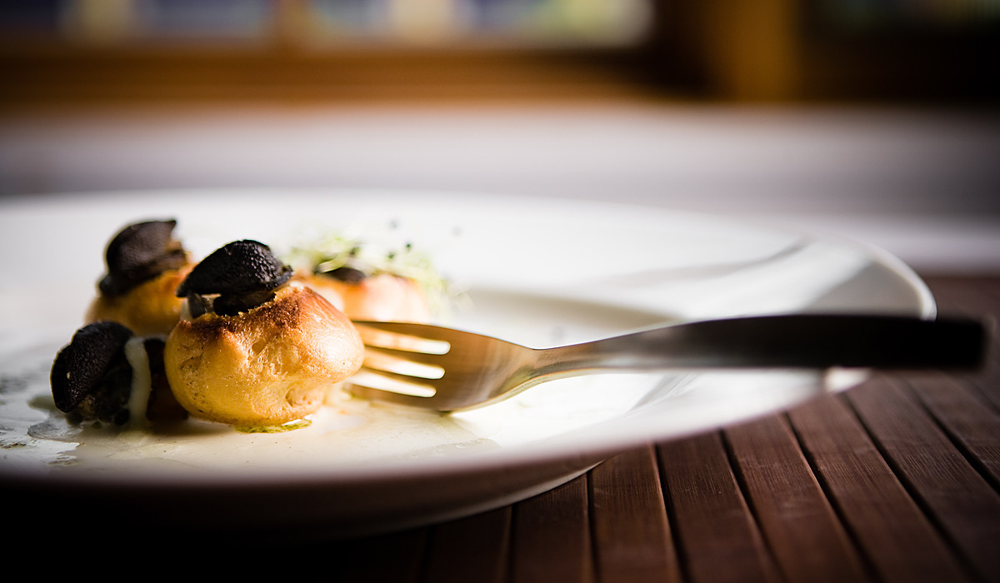
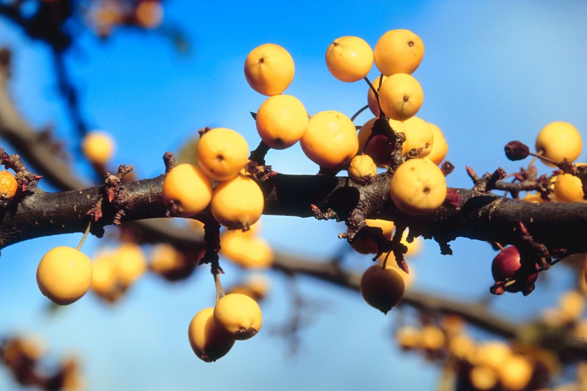
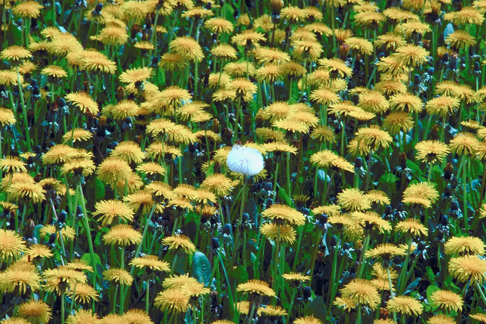

# What is wild food?

Wild food is anything edible that has not been raised, planted or grown by humans. It can include plants, fungi and animals. Humans once relied on wild food to survive, however, we have now lost a lot of this knowledge. Many plants that we describe nowadays as weeds can be eaten and are both delicious and nutritious. In fact, a lot of modern farmed foods were developed from the ancestors of these plants. It is ironic that farmers often clear fields of weeds so that they can plant crops, but some of those weeds contain more vitamins and minerals than farmed foods. An example of this is the wild plant ‘fat hen’ which contains more protein and iron than spinach and more calcium than cabbage. Like many other wild foods it can be cooked in exactly the same way as regular vegetables. Collecting wild food, especially mushrooms, is still very popular in some countries of continental Europe, but is still a rare habit in Britain.

* * *

# What are the benefits?

Collecting wild food can also be very beneficial to the environment. It has no packaging, no chemicals are used to make it grow and it can all be gathered in your local area, which cuts down on transport costs and pollution from traffic fumes. Picking wild food will also mean that we appreciate nature more and are more interested in conserving species. Widening the range of species we eat promotes biodiversity unlike modern farming which can be damaging to the environment. Intensive farming uses pesticides which can have very damaging effects on wildlife if they eat plants that have been sprayed with the chemicals.

Consuming wild food reconnects us with where our food comes from and shows us how much we depend on nature to survive. It also highlights the importance of seasonal food and gives us an alternative to the current farming system. There are benefits for our bodies as seasonal food matches what we need at different times of the year. For example, in spring we can eat leafy greens that promote renewal and clean out our digestive tracts. Collecting wild food is also a great way to enjoy the countryside.

* * *

# What can I eat and how do I find it?

Foraging for wild food can be very exciting as you never know what you’re going to get. Wild plants and fungi can be found in many places, both in the countryside or on wasteland in towns. Not only is wild food free, but it has also grown without us having to do anything. Anyone can gather wild food but there are some important principles to remember. If you are picking for the first time, look for things that you are already familiar with like nettles or dandelions.

You should never eat something that you are unsure of. Remember that many wild foods are poisonous and have to be cooked before you eat them. You will need a good book to identify species and you should go out with an expert or book a course. The Wildlife and Countryside Act (1981) states that it is illegal to pick anything without permission from the owner of the land. You should also not pick any species that are near a road, or that could have been contaminated with chemical sprays. It is important to pick only what you need and not to damage the plants in any way. Remember that animals also rely on these foods, so don’t take everything you find. If foraging does interest you then you should try and attend a foraging course, this will make it easier to identify edible plants when you see them in the wild.
