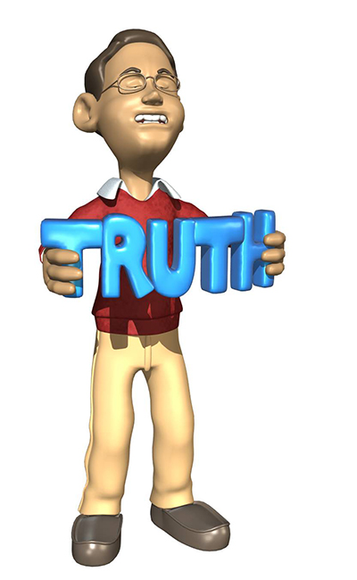

# Urban legends FAQs

## Here we deal with some of the most common questions about urban legends.

**Q: Why the name urban legends?**

A: This is a good question as not all urban legends take place in urban environments. Another name for urban legends is actually contemporary legends. The main reason for the urban part is to separate them from the more traditional legends which were often took place in a rural setting.

**Q; When was the name urban legends first used?**

A: This is difficult to answer but the phrase became widespread in the early 1980s when writer Jan Harold Brunvand published his first book on the topic in 1981 called The Vanishing Hitchhiker: American Urban Legends and Their Meanings.

**Q: Are urban legends ever true?**

A: Yes, sometimes! Often there are small pieces of truth in the story, even though most of the details are false. Remember, urban legends are not defined as false stories, they are stories that are supposed to be true with no supporting evidence.

**Q: How can you spot an urban legend?**

Because urban legends have shared characteristics it is fairly simple to spot an urban legend. Here is how to tell fact from fiction:
