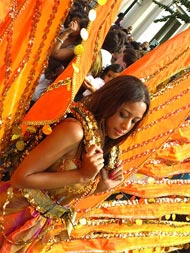

# TOP TIPS: Notting Hill Carnival

The Notting Hill Carnival is a big Caribbean street festival which takes place every year in Notting Hill in London. Carnival is always on the August bank holiday weekend (the last Sunday and Monday in August). The first Carnival took place in August 1964 and was organised by some Notting Hill inhabitants from Trinidad. Since then, the Carnival has grown and now attracts nearly two million visitors every year. The Carnival procession includes dancers and music, played by traditional Caribbean steel drums.

The Carnival is a wonderful affair, but there are a lot of people- so you need to take some simple precautions to ensure you stay well and safe.

*   You can't drive there. There are just too many people. The only way to get there and back is by public transport. But some Tube stations may be closed- check before you go! And Carnival goes on all night, so think about how you can get home: the Tube stops at 1 am.
*   Think about your clothes. If you're going to stay late, it can get cold at night in London. You'll have to walk a lot, so wear comfortable, practical shoes.
*   It's best to enjoy the Carnival with your friends- but in such big crowds you can easily get separated. Try to stay together, but plan a meeting point in case you get lost.
*   Research your trip before you leave. Look at the Carnival programme. Use the internet. You'll certainly need to know where the toilets are! Plan, plan and plan! Buy your tickets for the party several days before. And take a map with you when you go- this is essential.
*   Lastly- it's not dangerous, but in any large crowd of people you must always beware of thieves and pickpockets.

* * *
