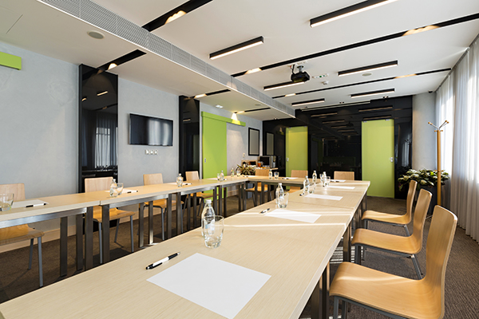
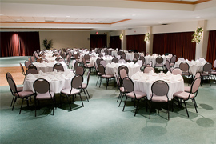
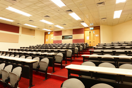
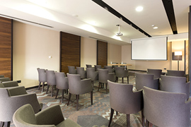
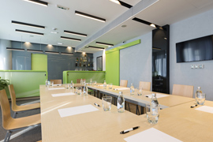
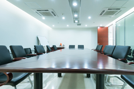
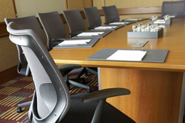
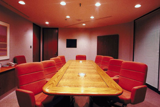

# Why Choose Us?

76 Portland Place is an award-winning conference venue situated in the heart of London's West End, just twenty minutes from St. Pancras and Paddington railway stations. If you are looking for a range of contemporary facilities combined with stunning Georgian architecture, 76 Portland Place is the ideal location.

Our function rooms are ideal for board meetings and conferences, corporate parties, training and team building and private dining. The professional team is dedicated to providing the highest standard of service.

What distinguishes 76 Portland Place from its competitors is our close attention to detail, giving you the service and attention you need to make your event a great success.

***

## Our Rooms

***
<right></right>

## Rutherford Theatre

The Rutherford Theatre can accommodate 170 in lecture theatre style and 120 in cabaret style. It is a contemporary purpose-built room with integrated audio-visual equipment.
***
<right></right>

## Franklin Theatre

With a capacity of 90, this purpose-built theatre features the latest audio-visual equipment including a large screen (4.6 x 2.1m).

***

<right></right>

## Hooke Room

The Hooke Room can seat up to 48 in cabaret style or 80 in lecture theatre style. It comes with webcasting technology and audio-visual equipment.

***

<right></right>

## Herschel Room

This stunning room has a capacity of 45 lecture theatre style, 18 boardroom, cabaret for 30 and dinner for 60 and also includes the latest audio-visual equipment.

***

<right></right>

## Phillips Room

The Phillips room seats up to 45 people in lecture theatre style and 33 people in boardroom style. A sound proof moveable wall allows the room to be split into two.

***

<right></right>

## Ada Lovelace Room

The Ada Lovelace room can seat 40 in lecture theatre style and 20 in a boardroom set-up.

***

<right></right>

## Guthrie Room

The Guthrie room seats up to 24 people in boardroom style. This is an ideal training room.

***

<right></right>

## Eddington Room

The Eddington Room is suitable for 18 in boardroom style. A complimentary flipchart is placed in the room.

---
section: sidebar_section
---

## Where are we?

Located in the heart of London, we are within 10 minutes' walk of 5 tube stations, and also within easy reach of Euston, Paddington & St Pancras mainline stations.
