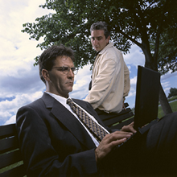
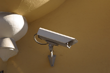

## PRIVACY FOR ALL

Protecting your right to privacy in a technological world

##### **What is privacy?**
<right></right>
People don't usually share the same information about themselves with their bosses or colleagues as they would with their family or close friends. Privacy can be defined as the right to exercise choice over who knows what about you and in what situations. For example, you have the right to keep your medical records, bank details and personal correspondence private and secure. Privacy is fundamental to human dignity and freedom in all societies.

##### **Why does privacy need to be protected?**

<right></right>

Technology has complete transformed the world we live in, the way we conduct business and the way we interact in our personal relationships. At the same time, the fear of terrorism is giving governments an excuse to extend state surveillance and cut back civil liberties. We believe that technological advances should reinforce, not reduce, everybody's right to a private life. Whatever a person's nationality, religion, political beliefs or financial status, their personal information and private communications must be kept safe and private.
<right></right>

##### **What does Privacy For All do?**

At Privacy For All, our mission is to defend the right to privacy throughout the world. In particular, we wage campaigns to fight surveillance and other intrusions into private life by governments or corporations. Privacy For All was set up twenty years ago and thus is one of the world's longest-established international privacy organisations. Privacy For All is a registered charity based in the UK..
