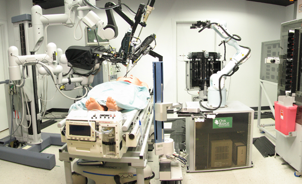
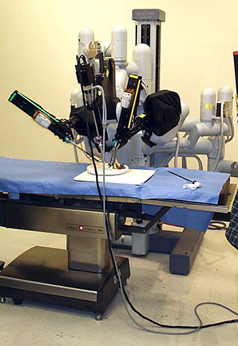

### Telesurgery (The Surgery of the Future)
---

**By Karen O'Shea**

A patient lies on an operating table. Gathered around him are medical assistants clad in blue scrubs and masks. He counts down from ten, but loses his chain of thought as he drifts out of consciousness at four. The operation is about to begin. However, one crucial member of the operating theatre is nowhere to be found. In fact, the surgeon is not even in the same continent, let alone hospital, as his colleagues. In a dimly-lit room many thousands of miles away, the surgeon prepares to carry out the operation entirely reliant on television monitors, a surgical console, a computer, and a high-speed fibre-optic connection linking him to robotic arms that he is about to masterfully manipulate Welcome to telesurgery – a technology with the potential to change lives around the world for the better.

Although still experimental at present, telesurgery has the potential to provide people in remote locations worldwide with the very best medical care available. The goal is to allow all patients to receive the most advanced treatment possible, so that ultimately those who live in remote villages will be able to access the same standard of medical care as those who live in big cities. "The experiment so far has proved that telesurgery is a practical possibility regardless of the distance between patient and surgeon. Similarities can be drawn with the promise of the Internet in the last decade of the 20th century. It's a network that can be used to provide medical care worldwide" explains Dr. Reza Mahravi, Director of the Association of Remote Medics and Surgeons (ARMS), in Edmonton, Canada.

Telesurgery first appeared on the world stage in September 2001 when the first ever transatlantic surgical procedure linked the cities of New York and Strasbourg at a distance of almost 4,000 miles. In homage to Charles Lindbergh, the pilot of the first ever solo non-stop flight across the Atlantic, they named it "Operation Lindbergh" and, like Lindbergh's, it was an extraordinary breakthrough that gave us a glimpse of the future. "We are now able to lengthen the reach of surgeons so that they can assist in surgery taking place anywhere on the planet," said Dr. Jacques Marescaux, leading the surgery from New York. The patient, a Strasbourg native, was a woman who was in need of a relatively minor gall bladder operation. The surgeon’s actions were transmitted to robotic surgical instruments in Strasbourg via fibre-optic cables with only minimal delay. Meanwhile the role of the surgeon's eyes was played by an endoscopic camera which sent images from within the patient's body to the surgeon's monitor. This fibre-optic connection also allowed the doctors to discuss the procedure through a videoconference link between the two rooms, as well as a continuous data exchange between computers on both sides of the ocean.

The need for connection speed and reliability prompted the Strasbourg hospital's bandwidth provider, France Telecom Group, to ensure the operation had access to both exclusive local and transatlantic fibre access. As a result, the delay was minimal – around 150 milliseconds – and this in itself was incredible progress for the telecommunications provider, as well as telesurgery.

Several years later, Dr. Mahravi, a prominent thoracic surgeon based in Canada, undertook a series of long-distance surgical operations between St. Andrew's Hospital in Edmonton, and Caribou Lake Hospital, an isolated community hospital located nearly 500 kilometres north. "Thanks to this technology, I can feel as if I am in the operating theatre in Caribou Lake performing ordinary surgery. We can connect our main teaching hospitals with those of smaller communities and allow their surgeons to confidently undertake more technically complex procedures knowing that assistance is on hand should they require it," says Dr. Mahravi. He continues to be dedicated to the long distance mentoring of trainee students and teaching of the techniques required for telesurgery, which still require some acclimatisation as the slight delay – even as small as 10 milliseconds – takes some getting used to.

## About the author

Karen O'Shea is the PROGRESS Science and Technology Editor. She has published a series of publications on the subject of various cutting edge medical technologies and her work has been adapted for both BBC and NATIONAL GEOGRAPHIC documentaries.
