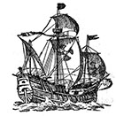
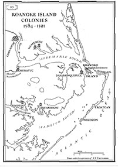

[ROANOKE: THE STORY](index.html)

[ROANOKE: KEY PEOPLE](index.html)

## 
The Mystery of Roanoke:

# 
The Story

English explorers had been sailing across the Atlantic Ocean since the middle of the 1500s.
Sometimes they explored the east coast of North America.
The English explorers also often acted as royal pirates and attacked Spanish treasure ships carrying gold and silver from Central and South America.
**Sir Francis Drake** was England's most famous explorer.
He also stole treasure from the Spanish ships.

The Queen of England was **Elizabeth I** She gave **Sir Walter Raleigh** permission to begin England’s first colony in North America. In July 1585, **Raleigh** sent 7 ships with 100 men to an island off the coast of what is today called North Carolina. The natives of the area called the island Roanoke Island. **Ralph Lane** was appointed governor of this new colony.

**Sir Francis Drake** visited Roanoke Island in 1586 and found the colonists were starving. He rescued them and took them back to England.

The following year Raleigh sent a second group of colonists to the island. The group consisted of 115 people, this time including women and children. The governor of the second colony was an artist named John White. The colonists landed on the island in July 1587, so it was too late in the year to plant the seeds they had brought with them. Realising that food would be a problem again, **John White** returned to England to bring more supplies.

Unfortunately, England was now at war with Spain and for three years White could not get a ship to take him and supplies back to Roanoke. When he finally returned to Roanoke, the colonists had disappeared.

The only clue to what had happened to them was the word _Croatoan_ carved on a tree. Croatoan was the name of a nearby island, and of the American Indian tribe that lived there.

**So far, the mystery of the “lost colony” of Roanoke has never been solved.**
