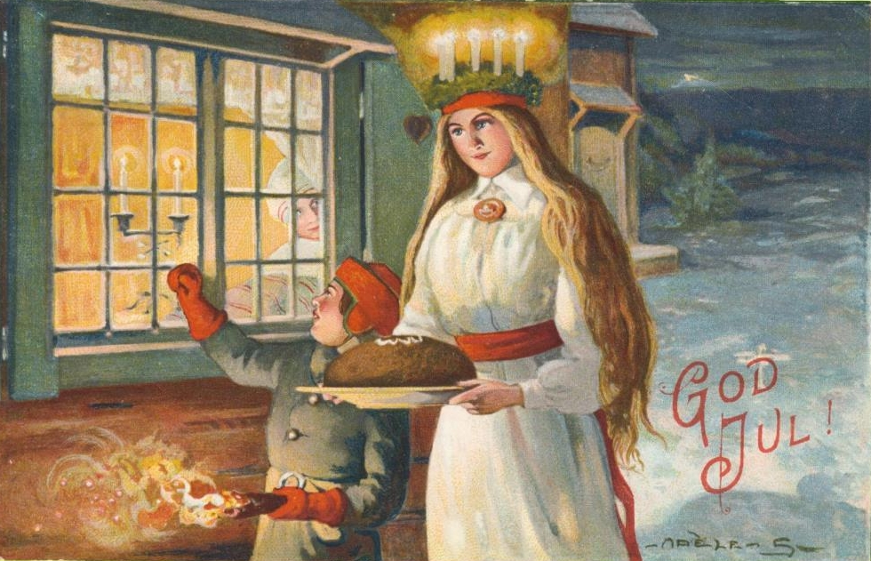
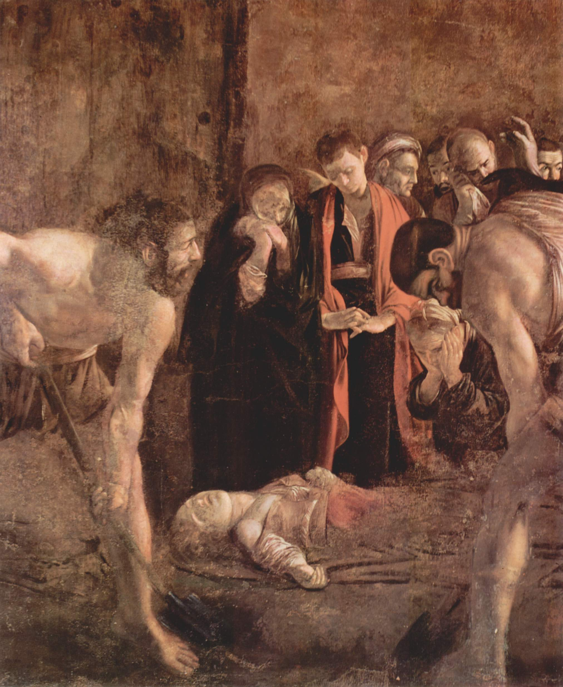

# THE FESTIVAL OF SANTA LUCIA

_by Maria Gustafsson_

The festival of Santa Lucia begins before dawn, on the thirteenth of December, which under the old Julian calendar (used in Sweden before 1753) was Christmas Day and the longest night of the year. Throughout Sweden, the oldest daughter in each household is the Lucia Bride and she comes to her sleeping parents, dressed in a long white gown tied with a red sash, and wearing a crown of leaves in which are set seven lighted candles. In her hands she carries a tray of hot coffee and 'Lussekattor' (Lucia cakes). She is accompanied by her sisters and brothers, also dressed in white, holding lighted candles, and singing of the light and joy of Christmas. Awakened by the lights and the singing, the parents arise and eat the breakfast served, thus ushering in the Christmas season.

Scandinavian tradition holds that in the Swedish province of Vaermland, a white-clad maiden, wearing a crown of burning candles, brought food to the starving villagers on the shores of Lake Vaenern. No one knows how long ago the tradition began, but it was so far back that the festival was marked with a cut on a primitive 'calendar stick', the precursor of the modern calendar. It later became customary in western Sweden to finish work in the fields by Lucia Day so as to begin the cooking and baking for the coming Christmas festivities. From its beginnings in Vaermland, the customs in honor of Santa Lucia have spread throughout Sweden, and more recently to the rest of Scandinavia. Today, the festival is celebrated in schools, hospitals, businesses and towns, each of which has its own Lucia Bride and festivities to mark the beginning of Christmas. Santa Lucia Day is also an international holiday, celebrated not only in Scandinavia, but also in Italy and France.

However, the origins of this tradition are not in Scandinavia, but in Syracuse on the island of Sicily around 304 A.D. According to the Sicilian legend, Lucia's mother, a wealthy lady, had been miraculously cured of an illness by Saint Agatha in Catania. Lucia, a Christian, persuaded her mother to show her gratitude by distributing her wealth to the poor. So, by candlelight, the mother and daughter went about the city secretly ministering to the poor of Syracuse.

Unfortunately, this was during the last great persecution of Christians in the reign of the Emperor Diocletian. The pagan young man to whom Lucia was engaged took a dim view of this distributing of her dowry, and denounced her to the town elders, who ordered that she be seized and tortured. Miraculously, neither boiling oil nor burning pitch had the power to hurt her; she was then blinded and killed with a sword. Her martyrdom is recorded in ancient sources and in an inscription found in Syracuse.

No one knows how or when this legend and tradition reached Sweden. When Christianity came to Sweden shortly after 1000 A.D., missionaries and priests may have told the story to inspire new converts. Another possibility is that sailors from Sweden may have been captivated by the popular candlelight festival of Santa Lucia in Italy and brought the tradition back with them. A newer theory, requiring more research, is that St. Birgitta (1303-1373), during her stay in Rome (1349-1373) in her effort to get papal approval of the Bridgettine Order for women, probably wrote home to Sweden telling of the Lucia legend, which was widely known in Italy. As Lucia Day is at the darkest time of year, the candles of Santa Lucia bear witness to the True Light: the birth of Christ. On the morning of the thirteenth of December, the strains of 'Santa Lucia' are heard everywhere in Sweden as the white-robed maiden comes out of the night with her crown of candles dispelling the darkness. In honour of her martyrdom, it has long been the custom to donate money on Lucia Day to institutions working for the blind.
