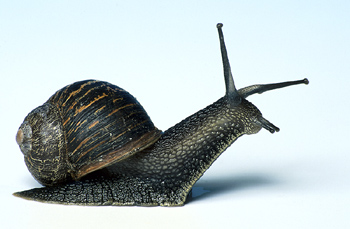

## Snail Stew by Aristea

_03.05.2016_

_In Crete snails are eaten as a main meal, so a normal serving is about 15-20 snails per person. There are many ways to cook and serve snails. This is a traditional recipe for them._

***

### Preparing snails

Here in Crete we find snails in the wild (see my April 2011 post). Make sure the snails are alive before you cook them – put them in cold water and wait for signs of movement. Take each live snail out of the cold water and throw it immediately into a pot of boiling water. This kills it.

### Cooking the snails

Boil the snails in salted water for 20 minutes, changing the water when it gets slimy. Drain the cooked snails, put them in a bowl and cover them with wine. Leave them to marinate in the wine for two hours.

### Making the stew

As well as the snails you will need:

1 onion, chopped
4-6 cloves of garlic, crushed
3 large ripe tomatoes, chopped or grated
olive oil
1 1/2 cups of cracked wheat

Sauté the onion and garlic in olive oil until soft. Add the chopped tomatoes and simmer for 10 minutes. Add 4 1/2 cups of water and when the mixture starts to boil, put in the cracked wheat and some salt. Stir well, then cover the pot and cook the mixture on low heat for 10-12 minutes, stirring frequently. Remove the pot from the heat, stir in the snails, cover the pot and leave the entire dish to settle for 20-30 minutes before serving.

***
