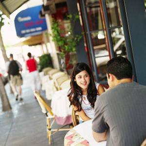
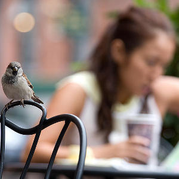
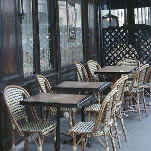
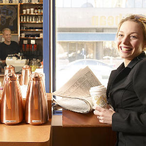

  

# Overview #

Established in 1954, The Minstrel is one of London’s few remaining coffee houses of the beatnik era. The club was one of several London coffee house venues at which notable musicians of the 1960s played, including Dylan Robertson, The Gathering Moss, and Los Pajaros.

The Minstrel is now a thriving cafe-bar and restaurant with a club which continues to host live music and poetry, mainly by performers who, in the club's tradition, write their own material. The performance space has doubled in size over the years yet remains an intimate venue of just 120 seats. The Café is open every day and you can come any time (before midnight); eat or drink whatever you like whenever you like; stay as long as you like (again, up to midnight).

Their menu is a mix of The Minstrel’s classics – crêpes, burgers, steaks, salads – with daily specials. They also offer daily soups dependent on what is available at the market and have a daily ‘one pot wonder’ and fresh soups, so do go in between midday and 4pm to make sure you don’t go hungry, no matter how short your lunch break!

!

<h1>Reviews</h1>

---
section: contents2
---

**263-7 Old Brompton Road Earls Court Kensington and Chelsea London SW5 9JA:**
 
Earls Court 
**Transit information:** 
District West Brompton 
**Phone number:** 
020 7771 13234 
**Price range:** £11-£25 
#### Hours
Mon 9:00 - 0:00 
Tue 9:00 - 0:00 
Wed 9:00 - 0:00 Open Now 
Thu 9:00 - 0:00 
Fri 9:00 - 0:00 
Sat 9:00 - 0:00 
Sun 9:00 - 0:00 
