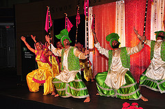
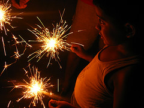
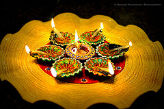
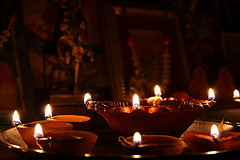

# About Diwali

Celebrated with enthusiasm by people of all nationalities, races and religions, Diwali, the festival of lights, is a magical festival of joy and colour. It celebrates the victory of good over evil, the triumph of light over darkness and of hope over despair. The word Diwali (Deepavali in its full form) means ‘a row of lamps’.

Diwali is a time to make a new beginning and renew commitments to family values. The festival focuses on all the virtues in life, such as love, reflection, forgiveness and knowledge.

## Hindu Festival of Diwali

 

Hindus celebrate Diwali for five days. The first day of Diwali is called Dhanvantari Trayodasi. On this day Hindu families offer prayers to Lakshmi, the goddess of wealth, to remember that all wealth is a blessing from God.

The second day is called Narak Chaturdasi. It celebrates Lord Krishna’s defeat of the demon king Narakasura, after which Krishna set free 16,000 women who had been prisoners of the demon. This day reminds us not to take advantage of others and to use our strength for the good of mankind.

The third day is actually Diwali. In the epic poem the Ramayana, the people of Ayodhya lit clay lamps (diyas) throughout the kingdom to celebrate Lord Rama’s return after defeating the demon king Ravana, who had captured his wife Sita.

The fourth day is the Hindu New Year, known as Govardhana Puja. On this day, Hindus offer thanksgiving to cows and worship Lord Krishna with offerings of food arranged in the form of Govardhana, a hill in Vrindavana. This day is a time to forgive others and renew relationships.

The fifth day of Diwali is called Bhaiya Duj. On this day Hindus celebrate the relationship between a brother and a sister. Every brother takes the time to visit his sister and her family.

## Sikh Festival of Diwali

For Sikhs, Diwali is a very important festival as it marks the release from prison of the sixth guru, Guru Hargobind, along with 52 other princes, an event which happened in 1619.

According to Sikh tradition, the Emperor Jahangir had imprisoned Guru Hargobind and the princes. The Emperor agreed to release Guru Hargobind, but Guru Hargobind asked for the princes to be set free too. The Emperor didn’t want to let all the princes go, so he said that only as many princes as could hold onto the tail of the guru’s cloak would be allowed to leave the prison.

Guru Hargobind then had someone make a cloak for him with 52 pieces of string so that each prince could hold onto the cloak and leave the prison.

## Jain Festival of Diwali

 

For the Jains, Diwali is a festival of light which represents the wisdom that Lord Mahavira gave to people regarding the peace and welfare of all living beings. It celebrates the anniversary of Mahavira and his chief disciple, Gautam Indrabhut, reaching important spiritual goals in 527 BCE.
