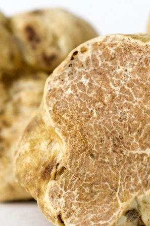

# White Truffles

## Tuber magnatum

<right></right>

White Truffles, also known as Piedmont White Truffles, are edible mushrooms which grow underground on the roots of trees, especially oak, hazel, poplar and beech trees. They are found mainly in the Piedmont region of northern Italy but also exist in Croatia.

The most famous are from the countryside around the town of Alba in northern Italy.

Some connoisseurs consider White Truffles to have a superior smell and flavour to black ones. They are highly sought after, and their rarity makes them exceedingly valuable.

White Truffles have a thick, rough, brownish-yellow coloured skin and can reach as much as 12cm in diameter and 500 grams in weight, but the majority are nowhere near as big as that. Their flesh is pale creamy white or brown in colour with white marbling. Like the French black variety, Italian White Truffles are prized by gourmets for their taste and smell, which are more intense than that of Black Truffles. White Truffles are generally served uncooked in small quantities, such as shaved into thin slices over steaming buttered pasta or salads.

<right></right>

Because White Truffles produce a scent that mimics a male pig’s sex hormone, historically female pigs were used to help locate these underground delicacies. Recently, however, dogs have become more popular for truffle hunting since they can be trained to just locate the truffles whereas pigs tend to eat the truffles as soon as they find them. Without a trained dog (or pig!) to help them, most mushroom hunters would never find a White Truffle.

Attempts to cultivate White Truffles have met with little success and are opposed by truffle hunters on principle as mass production of truffles would decrease their price considerably.
