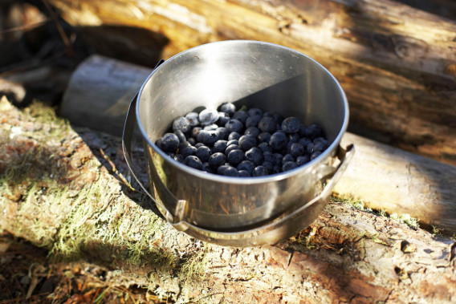

# Top ten tips for becoming a successful forager

Even in winter, skilled foragers are able to find plenty of wild, delicious food to enjoy. Foraging is all about eating according to the seasons, being in touch with nature and choosing locally grown food. And the best thing about it is that it’s absolutely free!

However, when you do go collecting wild food, don’t forget to follow the rules. The TV4 team of expert foragers have put together a list of tips for the inexperienced forager.

   
 

1.  Look after the countryside. Leave it as you found it and always follow the Country Code.
2.  Don’t be greedy! If you are lucky enough to find a lot of food, it doesn’t mean you have to take it all! Leave some for other people and, more importantly, for any animals that need this food to survive.
3.  Do plenty of research. Buy yourself a guidebook so that you can identify what you find. A great choice is Richard Mabey’s Food for Free. It was written over forty years ago but it is an absolute classic. Another author whose books are well worth a look is John Wright, who has written a series of foraging books including Edible Seashore and Mushrooms.
4.  Don’t pick anything that is growing next to a road, no matter how tasty it looks. Traffic fumes can make any food unsafe to eat. You should also avoid any plants that could have been sprayed with insecticides.
5.  Try and speak to other foragers in your area to find good spots to visit in search of food. Most parts of the country have foraging groups that you can join.
6.  Always be prepared. Remember to take warm clothes, plenty of water and something to eat. Also, if you go out foraging alone, make sure that someone knows where you are going and when you will be returning.
7.  The first time you go foraging, either take an expert with you or go on an organised foraging walk. This way you will get the confidence to correctly identify what is safe to eat.
8.  Remember; never pick anything if you are not sure what it is. Some mushrooms and berries are poisonous and can be very dangerous!
9.  Tune in to Wild Food on TV4 every week to get foraging tips and cooking ideas.
10.  Finally, get out there and have lots of fun foraging!
