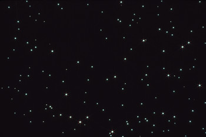

# One night, five sightings

**August 14 2008, 2215 hours**

A group of friends were travelling in two cars along the A483 Chester to Wrexham bypass when they claim to have been buzzed repeatedly by an elliptical configuration of lights that darted to and away from their cars, stopping at about 100ft above their vehicles.

For about 15 minutes the group were amazed at what they were seeing, but as quickly as the lights appeared, they were gone again.

That was the first call reported to North Wales ufologist Margaret Fry about that night.

Other people were so convinced that what they had seen was a UFO, that they called to report their sightings.

At Colwyn Bay, also reported to be at about 2215 hours, a woman out walking her dog at Colwyn Heights began to follow bright lights in the summer night's sky.

When the lights cleared some cloud the woman watched as the object appeared to stop and hover over a field.

At this time the woman reports that blue oval lights, arranged in a circular pattern, spun around the craft before it disappeared.

About 15 minutes earlier four women reported seeing about 12 opaque circles rotating and sweeping across the sky at nearby Towyn.

The phonecall by one of the group was short as the young woman said she and her friends did not want to get involved.

This same sighting just happened to be witnessed by two members of the Welsh Federation of Independent Ufologists who live in the area.

The last reported sighting of the night was at about 2230 hours when a couple from nearby Llangernyw, Conwy, reported seeing an oval of slanting blue beams of light.

A short time later the light changed to white in colour and about eight to 12 separate beams were seen to rotate and sway above a field close to where the couple were standing.

Investigator Margaret called a local night club to see if laser beams had been used that night and as well as calling local venues to see if fireworks displays had been held, she failed to identify the objects.
