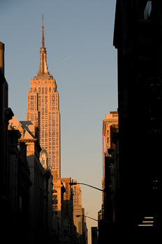
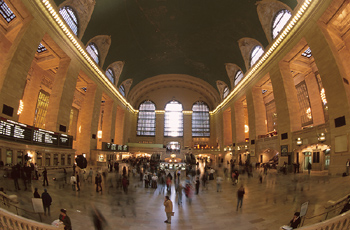

* * *

# Walking tour of midtown New York

Midtown is the heart of Manhattan. There are lots of famous landmarks and some great places to shop. For first-time visitors to Manhattan, this walking tour is a perfect way to get to know the city.

Start at **Macy's**, the world's largest department store. It is worth going inside, but it can be very busy in the holiday season. Go east along 34th Street, toward the **Empire State Building**, 102 stories of Art Deco splendor. Take the elevators up to the 86th- and 102nd-floors for fantastic views of the city.

Turn left and head north up Fifth Avenue. There are some famous shops along here, like **Yankees Clubhouse** and **Lord & Taylor**, a classic New York department store. At 42nd Street, you'll see the **New York Public Library**, a 1911 building with tall pillars and two stone lions at the entrance.

Turn off 34th Street and go east along 42nd Street to see **Grand Central Terminal**, Manhattan's busy train station. The inside is breathtaking, with long staircases and a high ceiling painted with stars. You can take an escalator down to the lower floor where there is a food court with a great selection of food.

Now exit Grand Central, and go back along 42nd Street. When you reach Fifth Avenue, cross the road. If you can, stop in the middle of the crosswalk for a perfect view of the **Chrysler Building** with its tall spire.

Keep going west to **Bryant Park**. It's a popular place for workers to come and enjoy their lunch break. If the weather's good, pick up some food and have a picnic.

After your lunch, continue up Fifth Avenue. Between 48th to 50th Streets is the **Rockefeller Center** – a complex of huge skyscrapers. At Christmastime, there's a giant Christmas tree and an ice rink in the plaza. It's worth going inside the **GE Building** to see its beautiful entrance hall.

Return to Fifth Avenue and continue uptown. There are lots of great, cheap shops, like **H&M** and **Sephora**. Continuing north, the shops get more expensive. There's a Prada store and the famous **Tiffany's** where you can buy yourself a fancy souvenir.

At 59th Street, you'll come to the **Plaza**, probably the world's most famous hotel. If you're feeling thirsty, the **Oak Room** bar is a comfortable place for a drink.

The tour ends at the corner of **Central Park**. This is one of the nicest parts of the park, near the zoo. Buy a hot dog and take the weight off your feet.
